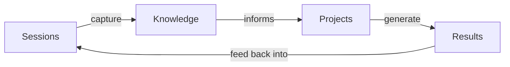
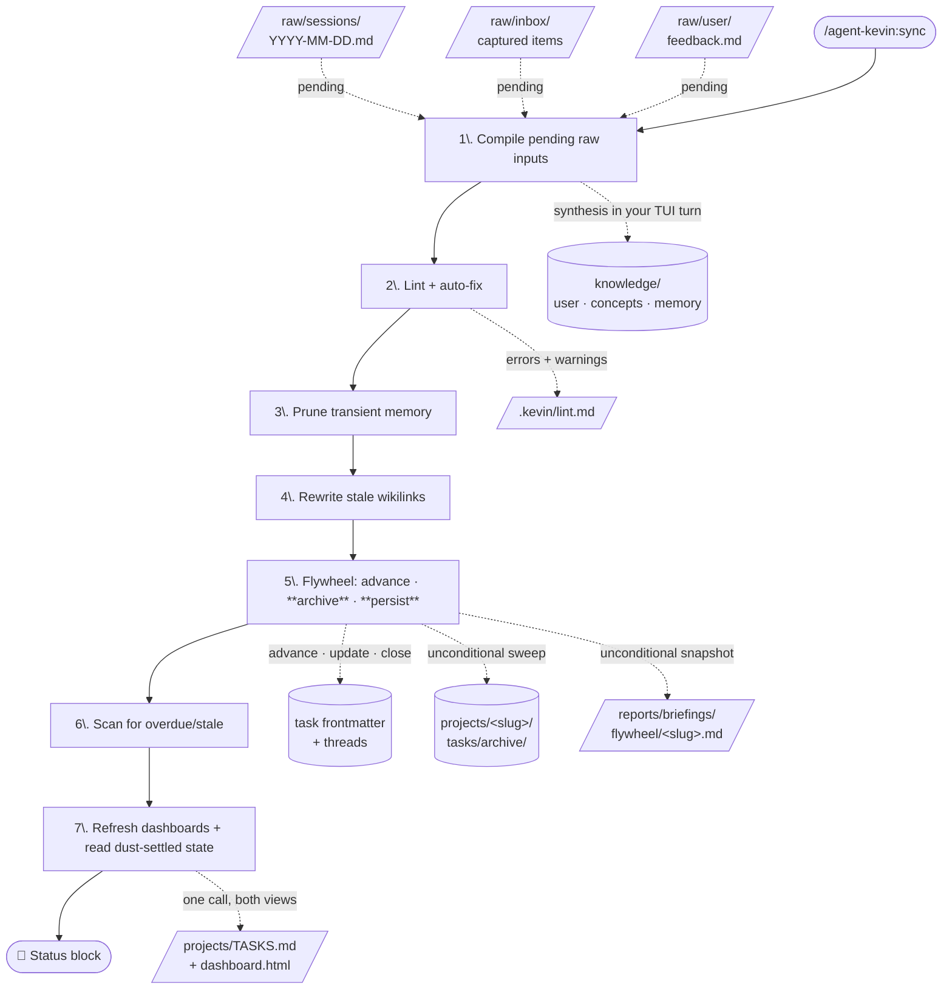
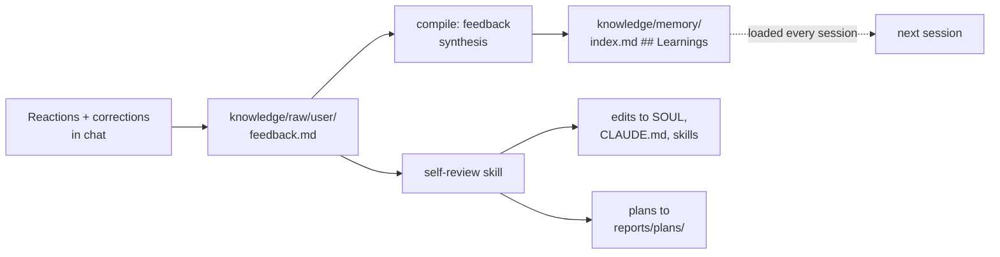
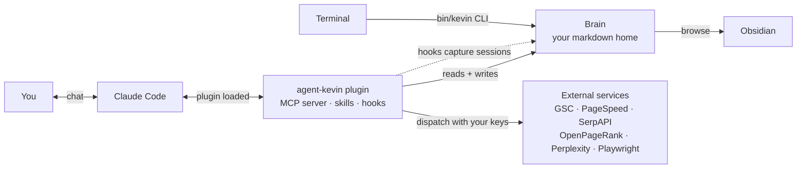

 <div align="center">


# Agent Kevin 🍌

**Your personal AI assistant, as a Claude Code plugin.**
One markdown folder, one plugin, a brain that learns who you are session after session.

<p>
  <a href="./LICENSE"></a>&nbsp;
  <a href="https://docs.claude.com/en/docs/claude-code"></a>&nbsp;
  <a href="#platform-support"></a>&nbsp;
  <a href="https://agentlayer.one"></a>
</p>

</div>

---

## 🤖 What is Kevin?

Kevin is a portable, file-based personal AI assistant that runs inside [Claude Code](https://docs.claude.com/en/docs/claude-code). Everything that makes Kevin *Kevin*, personality, memory, knowledge, projects, tasks, lives in your own directory as plain markdown. Any AI can read it. You can browse it in Obsidian or Finder. If you ever want to leave Claude Code, you take the folder and go.

This isn't a chat wrapper. It's an **operating system for personal AI**:

- A 28-tool MCP server for tasks, knowledge compilation, reports, search, page-speed, Playwright, and Google Search Console.
- A 20-skill library covering onboarding, project lifecycle, daily/weekly/monthly cadences, trip planning, and read-only SEO auditing.
- A knowledge pipeline that turns every conversation into structured, queryable memory.
- A skill-pack system for opt-in capabilities (SEO, Browser) and an install-on-demand bridge to community skill libraries via [skills.sh](https://skills.sh).
- Bundled behaviour is `disable-model-invocation: true` — Kevin only acts when you ask, never spontaneously. The exceptions are two read-only orientation skills, `dashboard` (refresh the mission-control page) and `where-am-i` (session radar), which Kevin can run on its own when you ask to see the big picture or where you left off; neither mutates knowledge or task state.

> *Kevin is named after the loyal minion. Helpful, enthusiastic, a little nerdy.*

---

## ⚡ Quick start

<details>
<summary><b>📦 Prerequisites</b> — what to install first</summary>

<br>

Kevin runs on a small, **bun-first** toolchain (no Node.js). Install these once:

| Tool | Why you need it | Get it |
|------|-----------------|--------|
| **Claude Code** | The host Kevin plugs into | [docs.claude.com](https://docs.claude.com/en/docs/claude-code/setup) |
| **Bun** ≥ 1.1 | Runtime for the MCP server, hooks, and the `kevin` CLI | [bun.sh](https://bun.sh) |
| **Git** | Cloning, the plugin marketplace, and Kevin's git-activity awareness | [git-scm.com](https://git-scm.com) |
| **Obsidian** *(optional)* | Browse the knowledge graph; opens dashboard links rendered, not raw | [obsidian.md](https://obsidian.md) |

Chromium (for the Playwright tools) is **not** a manual step — `bun install` downloads it into the plugin via a postinstall hook.

**On Windows?** The toolchain assumes a POSIX shell. Pick one:

- **WSL2** *(recommended)* — a full Linux environment where everything runs unchanged. [Install guide](https://learn.microsoft.com/windows/wsl/install)
- **Git Bash** *(experimental)* — native Windows plus the bash + coreutils that ship with [Git for Windows](https://git-scm.com/download/win). Native support is still being hardened (see [Platform support](#platform-support)).

</details>

### Option A: Install via `/plugin` (recommended once published)

First, `cd` to wherever you want Kevin's brain to live and launch Claude Code:

```bash
mkdir -p ~/Documents/Agents/Kevin && cd ~/Documents/Agents/Kevin
claude
```

Inside the session, register the marketplace and install the plugin:

```text
/plugin marketplace add github:AgentLayer1/agentlayer-claude-marketplace
/plugin install agent-kevin@agentlayer
/exit
```

Then enter `claude` again and run `/agent-kevin:init` to scaffold your home (see [Onboarding](#onboarding) below).

### Option B: Local development install

The plugin ships its own embedded marketplace (`.claude-plugin/marketplace.json`), so a local clone of `agent-kevin` is itself a marketplace you can register.

```bash
# Clone the plugin
git clone https://github.com/AgentLayer1/agent-kevin ~/Developer/agent-kevin

# One-time MCP-server deps install (~150MB, pulls chromium for Playwright)
cd ~/Developer/agent-kevin/mcp-server && bun install

# cd to wherever you want Kevin's brain to live and launch Claude Code
mkdir -p ~/Documents/Agents/Kevin && cd ~/Documents/Agents/Kevin
claude
```

Inside the session, register the local marketplace and install:

```text
/plugin marketplace add ~/Developer/agent-kevin
/plugin install agent-kevin@agentdev-kevin
/exit
```

Then `claude` again and `/agent-kevin:init` as above.

> Already have a `CLAUDE.md` in the directory? Kevin writes its operating manual to `CLAUDE.local.md` instead and leaves yours alone. Both files load at session start.

### Updating an installed plugin

Plugin updates are **not** automatic for third-party marketplaces — Kevin ships an explicit `version` in `plugin.json`, so you pull new releases on your own. Inside a session:

```text
/plugin marketplace update agentlayer    # refresh the catalog
/plugin update agent-kevin@agentlayer     # pull the new version
/reload-plugins                           # activate without restarting
```

(Local dev install? Swap `agentlayer` for `agentdev-kevin`.)

Prefer hands-off? Turn on auto-update via `/plugin` → **Marketplaces** tab → select the marketplace → **Enable auto-update**. Each launch then refreshes the catalog and pulls any new version automatically.

> ⚠️ **Auto-update is a global toggle per marketplace, not per plugin** — enabling it updates *every* plugin installed from that marketplace at startup, not just Kevin. Leave it off if you want to control exactly when each plugin changes.

---

## 💡 Why you'll want one



**The flywheel.** Every session makes Kevin smarter. Every project generates knowledge. Every piece of knowledge makes the next session better.

- 🧠 **Memory that compounds.** The `SessionEnd` and `PreCompact` hooks copy your conversation to `knowledge/raw/sessions/`. The `knowledge-compile` skill distils those raw logs into structured wiki articles (user profile facets, cross-cutting concepts, active memory). On your next launch, the compiled knowledge loads as @-imports before you've typed a word. **This loop is the entire evolution story.**
- 📋 **Project lifecycles, not just chats.** Spin up projects with `/agent-kevin:create-project`, track tasks with status / priority / dependencies, archive cleanly when they're done. Markdown files. Obsidian-friendly. Git-friendly.
- 🌅 **Daily, weekly, monthly cadences.** Morning briefings, evening wraps, weekly goals, monthly reviews. Built-in skills, run on demand.
- 🔍 **SEO that audits itself.** Plug GSC + PageSpeed + SerpAPI, run `/agent-kevin:google-search-audit`, get a ranked-by-impact diagnostic report.
- 🌐 **Web at your fingertips.** Bundled Playwright + chromium for screenshots, styled PDFs (markdown + mermaid rendered), URL → clean Markdown (handles SPAs), scripted page recordings. Optional Perplexity for live web research.
- 🏠 **Multiple homes, multiple personas.** One personal Kevin, one work Kevin, one SEO Kevin. Same plugin, different brains.
- ✅ **Subscription-billed**, not API-billed (see [Claude Code Billing](#claude-code-billing)).

---

## 🛰️ The Agent OS Dashboard

<div align="center">

</div>

There's a lot going on inside an agent — and even more going on in your life around it. The **Agent OS dashboard** shows both: **your life through Kevin's eyes**. Every `/agent-kevin:sync` regenerates **`<HOME>/dashboard.html`** — a dark mission-control page you open like any file (no server, no service). A left sidebar carries Kevin's wordmark, the page nav, your avatar, and the system-health badge; the pages are operator-first:

- **Today** — a time-aware greeting and stat strip, with sub-tabs: the plan (focus, next 7 days, waiting-on), your weekly/monthly/yearly goals, a "today so far" activity trail (sessions, tasks touched, commands run, output produced), and a News tab of headlines harvested from recent briefings.
- **Tasks** — the agenda grouped by due horizon (overdue → today → this week → this month → later) and a needs-attention view (blocked with reasons, going stale).
- **Projects** — color-coded project cards with description, done/total progress, and last-updated; click one to expand its tasks grouped by status.
- **Sessions** — your real working sessions (command runs filtered out) from the last 30 days, grouped by day with longer summaries, subtle turn counts, and the working directory only when it isn't the agent home.
- **Brain** — active memory threads and recent decisions, the Memory tab (daily memory with summaries, learnings, pending), concept articles, the compile pipeline, and the last lint run.
- **Reports** — everything Kevin has produced, grouped by day, skill chips color-coded, every title clickable.
- **Capabilities** — a cheatsheet of starter recipes, every skill as a tile (with an `auto` badge when the model may self-invoke it), every MCP tool, the full `kevin` CLI command reference, and hook wiring. The "what can I ask Kevin?" page.
- **Profile** — the operator page: your avatar, timezone, and the compiled profile rendered section by section (web links open in new tabs).
- **Persona** — Kevin's page: avatar, vibe, bio, core role, and soul traits rendered from IDENTITY.md and SOUL.md.
- **System** — sub-tabs for context assembly, settings (per-scope layers with their allow/deny/env contributions), and a scrollable log tail.

Pages and sub-tabs deep-link by hash (`dashboard.html#work/projects`), text filters narrow tasks/sessions/skills/tools/reports live, every project carries a stable color across its badges, and the pulsing health badge jumps you to whatever needs attention. Markdown links (tasks, reports, concepts, memory) open through a configurable opener app so they land rendered and editable rather than downloading as raw text — `obsidian://open?path={path}&paneType=tab` by default (the `paneType=tab` opens notes in a new Obsidian tab so the dashboard stays put); set the `MARKDOWN_URL` env var in `.claude/settings.local.json` to point elsewhere, e.g.:

```json
{ "env": { "MARKDOWN_URL": "markedit://open?path={path}" } }
```

**How to refresh it:** every `/agent-kevin:sync` does it automatically; `/agent-kevin:dashboard` rebuilds and opens it; `kevin dashboard` does the same from a terminal; the `dashboard` MCP tool is the programmatic hook. Every refresh also rebuilds `projects/TASKS.md` (and vice versa) — the two derived views always regenerate together. It's a **snapshot, not a live app** — the generated timestamp is in the footer. The file is fully self-contained and makes **zero external requests**: no CDN, no webfonts, no analytics. It renders identically offline, nothing on it leaves your machine, and regenerating it never mutates state.

> ⚠️ Privacy note: `dashboard.html` sits at your HOME root and reflects your tasks, knowledge stats, and (redacted) settings. If you ever publish that repo — e.g. enable GitHub Pages on it — this page publishes too. Keep agent homes private.

---

## 🎬 Onboarding

```text
> /agent-kevin:init

❓ Kevin's character (SOUL): accept default, or refine?
❓ Kevin's role (IDENTITY): general / coding / research / planning / custom?
❓ Your name and timezone?
❓ Paste any URLs about you (blog, LinkedIn, GitHub, etc.) so Kevin seeds your profile
❓ Paste a path or URL for your avatar (optional, gets linked to knowledge/user/profile.md)
❓ Should knowledge/ and projects/ live somewhere else? (e.g. ~/Documents/Agents/Kevin-Knowledge)
❓ Communication style and any hard preferences?
❓ Configure skill packs (SEO, Browser, third-party libraries)?
❓ Confirm + scaffold
```

Total time: ≈ 5 minutes. Each question's answer becomes the default for later steps. The wizard writes:

- `CLAUDE.md` (operating manual + identity @-imports), or `CLAUDE.local.md` if a CLAUDE.md already exists
- `SOUL.md`, `IDENTITY.md`, `USER.md` (Kevin's character / role / your headline)
- `knowledge/` and `projects/` directory trees, optionally at custom locations
- `.claude/settings.json` (marketplace registration + pre-granted permissions for the **always-on core** MCP tools: `ping`, `compile_*`, `task_*`, `knowledge_lint`, `links_rewrite`, `memory_prune`, `report_write`. SEO + Browser pack tools land here only when you activate the matching pack via `configure-skills`)
- `.claude/settings.local.json` (gitignored; init writes an empty `{}` — Kevin has no universal-infra env keys. Pack-gated keys like `PERPLEXITY_API_KEY`, `SERPAPI_KEY`, `OPENPAGERANK_API_KEY`, `GSC_SITE_URL` are planted by `configure-skills` when you activate the matching pack; you fill the values in your editor, never via chat)

If you chose custom `KEVIN_KNOWLEDGE` or `KEVIN_PROJECTS` paths **outside the home directory**, the wizard appends the required `permissions.allow` entries and (where supported) `sandbox.filesystem.allowWrite` entries to `<HOME>/.claude/settings.json` so Claude Code can read/write there without prompting you on every operation.

### Exit and relaunch

The plugin registration in `.claude/settings.json` only takes effect on a fresh session. After init:

```bash
/exit
cd ~/Documents/Agents/Kevin && claude
```

**Watch for a marketplace trust prompt** on first relaunch. Accept it. If you miss it, recover with `/plugin marketplace add ...` + `/plugin install agent-kevin@agentlayer`.

---

## 💼 What a session looks like

```text
$ cd ~/Documents/Agents/Kevin && claude

  🧠 Knowledge: ~/Documents/Agents/Kevin/knowledge
  📁 Projects:  ~/Documents/Agents/Kevin/projects
  📚 Context  · 4.2KB
    ✓ session tail   1.6KB  (YYYY-MM-DD.md)
    ✓ today reports  0.2KB  (1 briefing)
    ✓ git activity   0.3KB  (15 commits in the last week)

> /context
Context loaded from <HOME>/CLAUDE.md and its @-imports:

  CLAUDE.md                                operating manual + @-imports
  └─ @SOUL.md                              Kevin's character
  └─ @IDENTITY.md                          Kevin's role
  └─ @USER.md                              your headline + links to deeper user facets
  └─ @knowledge/index.md                   master catalog
  └─ @knowledge/memory/index.md            active threads · decisions · learnings
  └─ @projects/TASKS.md                    cross-project task dashboard

Read on demand (not auto-loaded — Kevin pulls them when relevant):
  · knowledge/user/{profile,skills,preferences,career,interests}.md
  · knowledge/concepts/<slug>.md
  · projects/<slug>/README.md + tasks

Dynamic (per-session, injected by SessionStart hook):
  · today's date (YYYY-MM-DD, <your-timezone>)
  · last session tail (yesterday's conversation)
  · today's reports (briefings, plans, audits written earlier today)
  · recent git activity in knowledge/

Plugin: agent-kevin@agentlayer · 28 MCP tools loaded

> /agent-kevin:morning-briefing
[Kevin reads your active threads, in-flight tasks, anything overdue, and surfaces what
 deserves your attention today, using yesterday's session tail as continuity context]

> Create a project called "new-blog". I want to relaunch under a different domain.
[Kevin runs /agent-kevin:create-project, scaffolds projects/new-blog/, registers the
 prefix, asks you for the one-line vision, opens for your first task]

> Audit the site I have in Search Console.
[Kevin runs /agent-kevin:google-search-audit, pulls 28 days of GSC, PSI on the top 5
 pages, applies 4 rules, ranks findings by impact, writes the report to
 projects/<slug>/audits/YYYY-MM-DD.md, threads matching findings into open tasks]

> /exit
[SessionEnd hook captures the conversation to knowledge/raw/sessions/YYYY-MM-DD.md,
 redacting any API key values from settings.local.json before persisting.
 Next time you run /agent-kevin:knowledge-compile, this session feeds into Kevin's
 long-term memory.]
```

The header banner (`🧠 Knowledge / 📁 Projects / 📚 Context`) is what the SessionStart hook injects on every launch — quick proof your brain is wired up. The `/context` slash command (built into Claude Code) shows the full @-imports cascade: identity stack, knowledge index, memory index, task dashboard, plus the dynamic per-session additions. User facets and concept articles aren't auto-loaded — Kevin reads them on demand via the links in `USER.md` and `knowledge/index.md`. That keeps the static lane lean while keeping the deeper material one read away.

---

## 🧠 How the knowledge pipeline works (the central evolution loop)

Kevin's long-term memory follows Andrej Karpathy's [LLM Wiki](https://gist.github.com/karpathy/442a6bf555914893e9891c11519de94f) pattern. Raw conversations are source code, an LLM is the compiler, the compiled wiki is your queryable second brain.


**The capture is automatic.** Every time you exit a session, or Claude Code auto-compacts mid-session, a hook calls `bin/kevin session-capture` which reads your transcript and appends it to today's session log under `knowledge/raw/sessions/YYYY-MM-DD.md`. The hook **redacts API key values** before writing (exact-match against `.claude/settings.local.json` env values, plus prefix heuristics for `sk-…`, `pplx-…`, `AIza…`, `sk-ant-…`, `gh[pous]_…`). The CLI is harness-agnostic — adding Codex (or any future host) is a one-file format adapter inside `mcp-server/src/knowledge/session-capture.ts`, not a new hook script.

**Capture anything else manually.** A thought, a meeting note, a clipped article, a file, a URL, a correction rule — anything you want compiled into the wiki goes in via the `capture` verb. Same destination, same compile pipeline; you just initiate it instead of a hook.

**In a conversation (the common case).** Drop a URL, paste a snippet, or hand Kevin a file path — he'll route to the `capture` MCP tool automatically. The tool is exposed as `mcp__plugin_agent-kevin_kevin__capture`, and natural-language prompts work fine:

```
you  > capture this for the inbox: https://thenewstack.io/hidden-agentic-technical-debt/
kevin > [calls capture(url=…)] → wrote inbox → knowledge/raw/inbox/2026-05-29-1430-hidden-agentic-technical-debt.md

you  > save as feedback: when refactoring, don't touch adjacent code I didn't ask about
kevin > [calls capture(text=…, kind=feedback)] → appended to knowledge/raw/user/feedback.md

you  > here's my standup notes — capture with title "Standup 2026-05-28": <paste>
kevin > [calls capture(text=…, title=…)] → wrote inbox

you  > pull in ~/notes/board-meeting.md
kevin > [calls capture(file=…)] → wrote inbox
```

URL fetches run through Mozilla Readability + Turndown, which extracts the article body (drops nav/footer/sidebar/modal noise) and converts it to clean Markdown — no HTML soup in the inbox.

**From the CLI** — same surface, useful for clipboards, scripts, and one-shots from a terminal:

```sh
# Inline thought → raw/inbox/<ts>-<slug>.md
kevin capture "remember to follow up with tracy on constitution lodgement"

# Local file → raw/inbox/ with an explicit title (overrides the auto-slug)
kevin capture --file=~/notes/board-meeting.md --title="Board meeting 2026-05-28"

# URL → fetch, extract article body, convert to Markdown, store with provenance
kevin capture --url=https://docs.anthropic.com/en/docs/claude-code/overview

# Stdin pipe → useful for clipboard / scripted captures
pbpaste | kevin capture --stdin --title="Clipped article"

# Correction / rule / preference → raw/user/feedback.md (compiled into memory/index.md → Learnings)
kevin capture --kind=feedback "don't propose git push for local-only repos"

# Optional metadata — label is stored in frontmatter (inbox) or in the feedback header
kevin capture --file=~/spec.md --label="design-spec"
```

| Flag | Behaviour |
|---|---|
| _(positional)_ or `--text=...` | Inline text. Default input source. |
| `--file=PATH` | Read a local file (≤ 512 KB) and capture its contents. |
| `--url=URL` | Fetch over HTTP(S) (≤ 5 MB raw). HTML responses run through Mozilla Readability (extracts the article body, drops nav / footer / sidebar / modals) → Turndown (HTML → Markdown). On extraction failure, falls back to a regex strip of `<script>/<style>/<head>/<nav>/<header>/<footer>/<aside>/<form>/<svg>/<iframe>/comments`. Sanitized body must fit ≤ 512 KB. Provenance recorded as `source: url:<url>` in frontmatter. |
| `--stdin` | Read from stdin. Auto-enabled when stdin is a pipe. |
| `--kind=inbox` _(default)_ | Write to `knowledge/raw/inbox/<YYYY-MM-DD-HHMM>-<slug>.md`. Compiled into concepts / user facets next compile. |
| `--kind=feedback` | Append to `knowledge/raw/user/feedback.md`. Operator-meta — corrections, preferences, rules. Compiled into `memory/index.md` → `## Learnings`. |
| `--title=X` | Sets the filename slug + frontmatter title (inbox only). Without it, the slug comes from the first heading / first line. |
| `--label=X` | Stored in frontmatter (inbox) or in the feedback entry header. Free-form tag. |

Local-only, secret-redacted (same heuristics as session capture), atomic write, content-hash deduped (re-capturing identical input short-circuits to the existing file). The same surface is exposed as `mcp__plugin_agent-kevin_kevin__capture` for use inside Claude Code sessions — same options, same defaults.

**The compile is on-demand.** When you run `/agent-kevin:knowledge-compile`, Kevin picks up any session logs whose hash has changed since last compile, plus any inputs you've captured into `knowledge/raw/inbox/` (via `kevin capture`, the MCP `capture` tool, or a direct file drop), plus any new feedback in `knowledge/raw/user/feedback.md`. The MCP server returns a synthesis prompt; *you*, in your TUI session, synthesize; the MCP server confirms the write. Idempotent, hash-tracked, interruptible.

| Output | Lifecycle | What lives there |
|---|---|---|
| `knowledge/user/` | Permanent, evolves with you | profile, skills, preferences, career, interests, the durable facets refined every compile |
| `knowledge/concepts/` | Permanent, cross-cutting | patterns and strategies spanning multiple projects. Specs distill into concepts here |
| `knowledge/memory/` | Hot context (`index.md` loads every session) | active threads, recent decisions, learnings from feedback. Daily entries auto-prune after 14 days |

**Why this stays cheap.** The compile MCP tool returns a synthesis prompt, Claude Code (you, in your TUI turn) runs the synthesis using your subscription, the result is written back via another MCP call. No internal LLM-as-a-service, no API billing.

---

## 🔄 Sync: end-to-end maintenance in one pass

`/agent-kevin:sync` runs the whole maintenance chain — compile → lint → prune → links → **flywheel** → scan → dashboards — when you want every derived view brought current at once. Heavier than `quick-pulse`, lighter than running each skill manually.



The dependency order is the point: compile feeds the wiki state that lint operates on; lint's auto-fix touches the same articles the dashboard's task-link rewriter needs to be clean. Flywheel runs *after* the wiki is clean (so it reads a current memory index) and *before* scan + dashboard refresh (so both views reflect post-flywheel task state). Running steps out of order makes you re-reconcile.

Two sub-steps of flywheel run **every sync, unconditionally**: the archive sweep (moves `done`/`cancelled` task files into `tasks/archive/` so the active dir stays scannable) and the snapshot persist (`report_write` to `reports/briefings/flywheel/` so the next morning brief can pick up the cross-session trail). Advance · update · close · concepts · decisions fire only when there's real work to do.

The status block reads from the **dust-settled artifacts** (`projects/TASKS.md`, `.kevin/lint.md`, `knowledge/memory/index.md`) — not from per-tool return values — so the summary reflects what's actually on disk after every mutation has landed. See [`skills/sync/SKILL.md`](skills/sync/SKILL.md) for the protocol.

---

## 🌐 Playwright web tools

Four MCP tools backed by a bundled chromium (installed once via `bun install`'s playwright postinstall, ~150MB). All four output to `<HOME>/reports/captures/<timestamp>-<name>.<ext>`. The Browser pack must be active (`/agent-kevin:configure-skills` → tick Browser pack) for the permissions to be pre-granted; without it the first call confirms.

| Tool | Output | Use it for |
|---|---|---|
| `playwright_screenshot` | PNG | Visual snapshot of any URL or local HTML / MD file; optional `fullPage` for the whole scrolling page |
| `playwright_pdf` | PDF (A4) | Render markdown (with mermaid diagrams) or HTML to print-styled PDF |
| `playwright_markdown` | Markdown | Convert any URL — including SPAs / Next.js / React sites — to clean LLM-friendly Markdown. Loads in chromium so client-rendered sections hydrate; pipes through Mozilla Readability + Turndown |
| `playwright_record` | WebM video | Drive a page through scripted steps (`navigate` / `scroll` / `wait`) and capture the run |

**All four take the same `input`** — a URL, a `file://` URL, or an absolute/relative path. `screenshot` and `pdf` will also render local Markdown files (loading them through `marked` + a styled CSS so mermaid renders). `markdown` does the reverse — fetches a hydrated page and converts back to Markdown.

**In a conversation (the common case)** — just ask:

```
you  > screenshot https://acme.com and call it acme-landing
kevin > [calls playwright_screenshot(input=…, name=acme-landing)] → reports/captures/<ts>-acme-landing.png

you  > render ~/Documents/business-plan.md to PDF
kevin > [calls playwright_pdf(input=…)] → reports/captures/<ts>-pdf.pdf  (mermaid diagrams come through)

you  > convert https://basem.emara.io to markdown — make sure the JS-rendered sections come through
kevin > [calls playwright_markdown(input=…, waitUntil=networkidle)] → reports/captures/<ts>-markdown.md

you  > record a 15-second tour of agentlayer.one — scroll halfway, wait 2s, scroll to the bottom
kevin > [calls playwright_record(input=…, steps=[{kind:scroll,pixels:600},{kind:wait,ms:2000},{kind:scroll,pixels:9999}])] → reports/captures/<ts>-record.webm
```

---

## 🌱 Self-evolution: Kevin gets better the more you use him



Every time you correct Kevin mid-conversation ("don't do that", "actually, that's wrong"), the SessionEnd hook captures the correction into `knowledge/raw/user/feedback.md`, append-only, durable. The next `knowledge-compile` run synthesises all feedback into a `## Learnings` block in `knowledge/memory/index.md`, which loads as static memory at the start of every future session. Kevin sees his own past misses while he works and self-corrects in real time.

When you have ten minutes, run `/agent-kevin:self-review`. It's not a quick pass over the synth — Kevin casts a wide signal net across **eight sources**: the `## Learnings` synth, the full `feedback.md`, the last 7 days of session logs and task threads, git history (to find prior-fix commits), concept articles, in-flight plans, and installed skills. Grep is for both correction *and* confirmation phrases — wins matter too, they validate non-obvious choices.

Each theme gets classified as **missing**, **buried**, **present-but-violated**, or **present-and-working** — the whole point is catching rules that landed but didn't stick. Themes rank by `severity × instance count × cycle count`; anything with fewer than two independent signals or `present-and-working` gets dropped. If nothing clears the bar, Kevin says so and stops.

Proposals come in three tracks:

- **Track A — prompt/skill edits.** Applied synchronously in-session, you pick which to accept. Surface choice is deliberate: identity → SOUL, procedural → CLAUDE.md, skill-specific → that skill's body.
- **Track B — code-change plans.** Written to `<HOME>/reports/plans/` via the `report_write` MCP tool, never auto-applied. You implement them in a separate session.
- **Track C — skill install or create.** Only when the signal is a recurring multi-step procedure. Requires explicit in-session approval.

Kevin also sweeps `<HOME>/reports/plans/` for aging proposals (>14 days, no follow-through) and proposes re-surface / downgrade / close on each one. A quality gate runs before any proposal lands — every target file actually read (not paraphrased), specific evidence (timestamps, quotes, file:line), coverage audit done, and for any pre-existing rule: violations counted *after* it was introduced.

**Three stages, loosely coupled.** Capture is automatic. Compile is on-demand. Review is manual. No ceremony.

---

## 🧰 Use cases

### 1. Personal home base
Track your projects, plan your weeks, capture decisions, remember context across sessions. Spin up `cd ~/Documents/Agents/Kevin && claude` whenever you want, ask Kevin what you were working on last Tuesday, get a coherent answer because the session tail loaded itself.

### 2. SEO + content workflow for one site
Configure GSC + PageSpeed + SerpAPI keys once. Run `/agent-kevin:google-search-audit` weekly (or wire it to cron). Get a markdown report ranked by impact, findings threaded into existing tasks. Pair with optional [third-party SEO libraries](#third-party-skill-libraries) for content drafting + EEAT scoring.

### 3. Multiple flavours of Kevin
Different homes for different roles. Each home is its own brain with its own configured skill packs.

```bash
~/Documents/Agents/personal-kevin/    # personal projects, journals, life ops
~/Work/agents/work-kevin/             # client projects, professional persona
~/Documents/Agents/seo-kevin/         # SEO-focused, only the SEO pack configured
```

The plugin code lives once on disk. Each home is independent. Switch by `cd`-ing into the home you want and launching `claude`. The right brain loads automatically.

### 4. Augmenting an existing project
You already have a project with its own `CLAUDE.md`. You want Kevin's memory + task system layered on top, without overwriting your existing instructions.

```bash
cd ~/Developer/my-existing-project
claude
/agent-kevin:init
```

Init detects the pre-existing `CLAUDE.md` and writes Kevin's operating manual to `CLAUDE.local.md` instead. Both files load at session start (Claude Code natively merges them). Your project context and Kevin's identity coexist.

### 5. Team-shared agent in a shared repo
Drop Kevin into a team repo, commit the `<HOME>/{CLAUDE.md, SOUL.md, IDENTITY.md, .claude/settings.json, knowledge/}` files, gitignore `settings.local.json`. Every teammate gets the same agent identity. Each accepts the trust prompt once on first launch.

---

## 🏗️ Architecture

The brain is portable markdown on your disk. Claude Code is the runtime. The plugin is the glue. Obsidian is how a human reads the brain. Terminal-driven scripts read and write the brain directly via `bin/kevin` when you don't want a session.



| Layer | What | Where |
|---|---|---|
| **You** | The decision maker | wherever you are |
| **Claude Code** | The AI runtime that reads the brain and acts on it | your terminal |
| **Plugin** | Skill bodies, MCP server, hooks | `agent-kevin/` (one repo, multiple homes) |
| **Brain** | Personality, knowledge, projects, everything that makes Kevin *yours* | `<HOME>/` (portable markdown) |
| **Obsidian** | Human-facing browser for the brain — clickable wiki-links, daily notes, graph view | `<HOME>/` opened as an Obsidian vault |
| **Terminal** | Bypass route for scripted task ops and headless compile runs | shell `bin/kevin` invocations |
| **External services** | Optional tools the MCP server dispatches to with your API keys | GSC, PageSpeed, SerpAPI, OpenPageRank, Perplexity, in-process Chromium |

---

## 🧱 What you get

### Core skills (14), always loaded

| Skill | What it does |
|---|---|
| `init` | First-run onboarding |
| `configure-skills` | Configure skill packs, install third-party libraries |
| `knowledge-compile` | Synthesise raw sessions/feedback/inbox items into the wiki |
| `create-project` / `archive-project` | Project lifecycle |
| `flywheel` | Cross-project work session |
| `sync` | End-to-end maintenance: compile → lint+fix → memory-prune → dashboard refresh → briefing in one pass |
| `morning-briefing` / `evening-briefing` | Daily orient + wrap |
| `weekly-goals` / `monthly-goals` / `yearly-goals` | Goal-setting cadences — weeks, monthly themes, and the year planned quarter by quarter |
| `quick-pulse` | 60-second status check |
| `self-review` | Process feedback into skill refinements |
| `itinerary` | Wizard-style trip planner → interviews you, researches flights/routes/prices, renders an interactive, print-ready HTML itinerary into a trips project |

> Custom-skill authoring isn't a Kevin skill, because Claude Code already ships a native [`skill-creator`](https://github.com/anthropics/claude-plugins-official) plugin that does exactly that. Use it for your own skills.

### SEO pack (6), pre-loaded, configured via `/agent-kevin:configure-skills`

`serpapi` · `open-page-rank` · `google-search-console` · `google-page-speed` · `wordpress-rest` · `google-search-audit`

Four need API keys (SerpAPI, OpenPageRank, Google OAuth + `GSC_SITE_URL` for the last two). `wordpress-rest` uses `curl` with a host-scoped permission grant derived from `GSC_SITE_URL`. `google-search-audit` is a composite read-only audit using everything above. Account signup steps and costs: [External accounts & costs](#-external-accounts--costs).

### Browser pack, configured on demand

- **Perplexity**, live web search with citations (`mcp__plugin_agent-kevin_kevin__perplexity_search`). Built into the `kevin` MCP server — direct call to the Perplexity Search API, no extra subprocess. Activate the tool via `/agent-kevin:configure-skills` (grants the permission + ensures a `PERPLEXITY_API_KEY` placeholder in `settings.local.json`), then fill the key value in your editor — `configure-skills` never asks for it in chat, since pasted secrets touch the transcript and the Anthropic API. Way better answers than vanilla web-search and dirt-cheap on pay-as-you-go: $5 of credit lasts most personal users several days to several weeks depending on query volume. Get a key at [perplexity.ai/settings/api](https://perplexity.ai/settings/api).
- **Playwright**, four web tools backed by a bundled chromium (drops in via the one-time `bun install`). See [Playwright web tools](#-playwright-web-tools) below for the full set, or here's the short of it:
  - `playwright_screenshot` — PNG of any URL or local HTML/MD file
  - `playwright_pdf` — styled PDF (markdown + mermaid rendered)
  - `playwright_markdown` — JS-rendered page → clean Markdown via Readability
  - `playwright_record` — scripted page interactions → WebM video

### Third-party skill libraries

Installed on demand via [skills.sh](https://skills.sh). Pure-prompt content/marketing skill libraries are not bundled. They install via Vercel Labs' `skills` CLI into `<HOME>/.claude/skills/` as symlinks into the skills.sh cache, so upstream updates propagate without re-running install. Currently offered:

- **[`aaron-he-zhu/seo-geo-claude-skills`](https://github.com/aaron-he-zhu/seo-geo-claude-skills)** (Apache-2.0): 20-skill SEO + GEO library including `content-quality-auditor` (80-item CORE-EEAT audit), `seo-content-writer`, `content-refresher`, `domain-authority-auditor`.
- **[`coreyhaines31/marketingskills`](https://github.com/coreyhaines31/marketingskills)**: 23 marketing playbooks (CRO, SEO, copy, analytics, experiments, pricing, launches, ads, social).

Install: `/agent-kevin:configure-skills` → tick "Third-party libraries".

### MCP tools (31)

| Group | Tools |
|---|---|
| **Tasks** (7) | `task_query`, `task_get`, `task_create`, `task_update`, `task_close`, `task_thread`, `task_scan` |
| **Knowledge** (7) | `capture`, `memory_prune`, `links_rewrite`, `knowledge_lint`, `compile_status`, `compile_next`, `compile_write` |
| **Reports** (1) | `report_write` |
| **Dashboard** (1) | `dashboard` |
| **Dispatch** (15) | `serpapi_search`, `open_page_rank`, `google_auth`, `gsc_query`, `gsc_inspect`, `gsc_sites`, `page_speed_psi`, `page_speed_audit`, `playwright_screenshot`, `playwright_pdf`, `playwright_markdown`, `playwright_record`, `browser_flows`, `perplexity_search`, `ping` |

**Always-on core** (`ping`, `compile_*`, `task_*`, `knowledge_lint`, `memory_prune`, `links_rewrite`, `report_write`, `dashboard`) is pre-granted via `permissions.allow` at init. **Pack-gated** tools (SEO: `serpapi_search`, `open_page_rank`, `gsc_*`, `page_speed_*`, `google_auth`; Browser: `perplexity_search`, `playwright_*`) only land in `permissions.allow` when you activate the matching pack via `/agent-kevin:configure-skills`. This keeps `settings.json` an accurate audit trail — it advertises only the packs you actually opted into.

### Hooks

- **SessionStart**: pre-init shows the setup banner. Post-init injects today's date, last session tail, today's reports (any briefings or plans written earlier today), and recent git activity (≤10KB total).
- **SessionEnd + PreCompact**: capture transcript turns to `knowledge/raw/sessions/YYYY-MM-DD.md` with API key redaction. **This is what makes the flywheel work.** Without these hooks, Kevin would have no source material to compile into long-term memory.

---

## 🗂️ How it's laid out

### The plugin (this repo)

```
agent-kevin/
├── .claude-plugin/
│   └── plugin.json          # plugin manifest
├── assets/                  # Kevin's avatar, AgentLayer logo
├── bin/
│   └── kevin                # standalone CLI for shell-driven task ops
├── hooks/
│   └── hooks.json           # SessionStart + SessionEnd + PreCompact
├── mcp-server/              # the kevin MCP server (Bun)
│   ├── src/
│   └── package.json
├── scripts/                 # one-off migration scripts (session-capture/start now live in bin/kevin)
├── skills/                  # 19 skills (13 core + 6 SEO) auto-load with plugin
├── templates/               # init copies these into <HOME>
│   ├── CLAUDE.md            # → <HOME>/CLAUDE.md (or CLAUDE.local.md on collision)
│   ├── IDENTITY.md          # Kevin's role (includes Kevin's avatar)
│   ├── SOUL.md              # Kevin's character
│   └── USER.md              # YOUR headline + links to knowledge/user/
├── .mcp.json                # declares the `kevin` MCP server
├── LICENSE                  # Apache 2.0
└── NOTICE                   # Apache 2.0 attribution
```

### Your agent home (after `init`)

```
<HOME>/
├── .claude/
│   ├── assets/              # Kevin's avatar (kept out of the home root)
│   ├── skills/              # third-party skill libraries installed via skills.sh (lazy)
│   ├── settings.json        # enabledPlugins + pre-granted permissions
│   └── settings.local.json  # API keys, gitignored
├── .kevin/                  # plugin runtime state (hidden)
│   ├── config/              # OAuth tokens
│   ├── logs/
│   └── knowledge.json       # compile state
├── knowledge/               # (or KEVIN_KNOWLEDGE elsewhere)
│   ├── concepts/            # cross-cutting articles
│   ├── memory/              # hot context (threads, decisions, learnings)
│   ├── raw/                 # unprocessed inputs to compile
│   │   ├── archive/         # compiled inbox items land here after compile
│   │   ├── sessions/        # auto-captured conversations (the source of evolution)
│   │   ├── inbox/           # drop any input here (or use `kevin capture`) for distillation
│   │   └── user/
│   │       └── feedback.md  # corrections log (append-only)
│   ├── user/                # evolving long-form knowledge about you (incl. profile.md with your avatar)
│   └── index.md             # master catalog
├── projects/                # (or KEVIN_PROJECTS elsewhere)
│   ├── <slug>/
│   │   ├── tasks/
│   │   │   └── <id>-<slug>.md
│   │   └── README.md
│   └── TASKS.md
├── reports/                 # transient skill outputs (briefings, plans)
│   ├── index.md             # auto-maintained "newest first" log (today's entries injected into SessionStart)
│   ├── briefings/           # morning/evening briefings, weekly/monthly goals, self-review summaries
│   ├── captures/            # playwright artifacts (screenshots, pdfs, recordings) — gitignored, regenerable
│   └── plans/               # self-review code-change proposals (Track B) + native plan-mode saves (plansDirectory)
├── .mcp.json                # only present if the user adds their own MCP servers — Kevin's bundled `kevin` server lives in the plugin's own .mcp.json
├── CLAUDE.md                # operating manual + @-imports for identity stack
│                            # (or CLAUDE.local.md if CLAUDE.md pre-existed)
├── IDENTITY.md              # Kevin's role + evolving self-description
├── SOUL.md                  # Kevin's character
└── USER.md                  # YOUR headline + links to knowledge/user/
```

Open `<HOME>/` in Obsidian to browse with working wiki-links. `.claude/` and `.kevin/` are hidden by default.

---

## 💻 Outside Claude Code: `bin/kevin` CLI

For terminal-driven task ops, cron jobs, scripted compile prep:

```bash
export PATH="$HOME/Developer/agentlayer-claude-marketplace/agent-kevin/bin:$PATH"

kevin help     # full command reference
```

`kevin help` prints groups, commands, flags, env vars, and examples. The major groups:

| Group | What it does |
|-------|--------------|
| `kevin task <subcmd>` | Query, get, create, update, close, thread, scan tasks |
| `kevin dashboard` | Rebuild both dashboards: `projects/TASKS.md` + the Agent OS page at `<HOME>/dashboard.html` |
| `kevin knowledge lint [--fix]` | Structural wiki health check (broken links, orphans, missing backlinks, sparse, invalid frontmatter); `--fix` auto-rewrites links + inserts backlinks |
| `kevin compile <subcmd>` | `status` (queue), `next` (peek), `write <id>` (mark complete). Synthesis itself runs in Claude Code via `/agent-kevin:knowledge-compile` |
| `kevin prune` | Delete `memory/YYYY-MM-DD*.md` older than the retention window (14 days) |
| `kevin links` | Rewrite bare task IDs + shorthand into `[[wikilinks]]` across the wiki |
| `kevin ping` | Print resolved paths + timezone (sanity check) |

Common examples:

```bash
kevin task query --status=active
kevin task create --project=blog-dev --title="Draft launch post" --description="..." --priority=P1
kevin task dashboard                  # rebuild projects/TASKS.md from frontmatter
kevin knowledge lint --fix            # check wiki + auto-fix broken links + backlinks
kevin compile status                  # what's pending compile
```

Note: `bin/kevin` invokes the MCP server logic locally without going through Claude Code. The compile pipeline returns prompts (not synthesized output), so full evolution still needs a TUI session — see [`/agent-kevin:knowledge-compile`](skills/knowledge-compile/SKILL.md) for the orchestration loop, or [`/agent-kevin:sync`](skills/sync/SKILL.md) to run compile → lint → dashboard → briefing in one pass.

---

## ⚙️ Configuration

| Env var | Purpose | Default |
|---|---|---|
| `KEVIN_HOME` | Path to your agent home. **Required** when launching `claude` from anywhere other than the agent home itself (subdirs, other repos, the user-level capture hook). | current working directory at launch |
| `KEVIN_TIMEZONE` | IANA timezone for date formatting | system timezone |
| `KEVIN_KNOWLEDGE` | Override knowledge dir | `$KEVIN_HOME/knowledge` |
| `KEVIN_PROJECTS` | Override projects dir | `$KEVIN_HOME/projects` |
| `KEVIN_REPORTS` | Override reports dir | `$KEVIN_HOME/reports` |
| `KEVIN_GIT_REPOS` | Comma-separated extra git repo paths (`~`-expanded) surfaced in the SessionStart context block alongside the knowledge repo | _none_ |
| `KEVIN_LOG_LEVEL` | Log level: `debug` · `info` · `warn` · `error`. Falls back to `LOG_LEVEL`. | `info` |
| `KEVIN_LOG_FILE` | Override log file path. Set to `off` to disable file output. | `$KEVIN_HOME/.kevin/logs/app.log` |

**On `KEVIN_HOME`.** When you launch `claude` from inside your agent home, the cwd-fallback works and you don't need to set anything. When `cwd` is somewhere else — a subdir of home, a sibling repo, or the user-level session-capture hook firing from a random project — the MCP server resolves paths relative to `cwd` instead, and writes land in the wrong place (or the `isInitialized()` guard fires and the hook silently no-ops). If you ever launch Claude Code from outside the home, set `KEVIN_HOME` in your shell rc or in `~/.claude/settings.json` `env`.

`KEVIN_KNOWLEDGE` and `KEVIN_PROJECTS` let you put those directories anywhere (e.g. iCloud, an external drive, a separate git repo). The init wizard offers this during scaffold and, if the chosen path is **outside the agent home**, automatically appends `permissions.allow` (and `sandbox.filesystem.allowWrite` where supported) entries to `<HOME>/.claude/settings.json` so Claude Code can read/write there without prompting. If you set these env vars after init, edit `settings.json` yourself.

API keys (`SERPAPI_KEY`, `OPENPAGERANK_API_KEY`, `GSC_SITE_URL`, `PERPLEXITY_API_KEY`) live in `<HOME>/.claude/settings.local.json` `env` block, gitignored. The rule: **init owns universal-infra env keys; `configure-skills` owns pack-gated env keys.** Kevin has no universal-infra keys, so `/init` writes an empty `{}` — every API key above is a pack-gated key that `configure-skills` plants as an empty placeholder when you activate the matching pack. **You fill the values in your editor** — neither flow asks for them in chat, since secrets must not enter the session transcript or the Anthropic API.

---

## 🔑 External accounts & costs

Kevin's core needs **zero external accounts**: tasks, knowledge compile, dashboard, session capture, and all four Playwright web tools (bundled chromium) run entirely on your machine against your Claude Code subscription. External accounts only enter the picture when you activate the **SEO** or **Browser** packs via `/agent-kevin:configure-skills`. Everything below is optional; skip this section if you don't need web search or SEO tooling.

| Account | What it unlocks | Pack | Credential | Cost |
|---|---|---|---|---|
| [Perplexity](https://perplexity.ai/settings/api) | `perplexity_search`: live web research with citations | Browser | `PERPLEXITY_API_KEY` | Pay-as-you-go, $5 per 1,000 requests. A $5 credit lasts most personal users days to weeks. |
| [Google Cloud](https://console.cloud.google.com) | `gsc_*` (Search Console data) + `page_speed_*` (Lighthouse audits) | SEO | OAuth client JSON at `<HOME>/.kevin/config/google-oauth-client.json` | Free. PSI quota is 25k requests/day per project. |
| [Google Search Console](https://search.google.com/search-console) | The site data behind `gsc_query`, `gsc_inspect`, and the audit skill | SEO | Your site verified under the same Google account | Free |
| [SerpAPI](https://serpapi.com) | `serpapi_search`: live Google SERP positions for rank tracking | SEO | `SERPAPI_KEY` | Free tier: 250 searches/month. Paid from $25/month (1,000 searches). |
| [OpenPageRank](https://www.domcop.com/openpagerank/) | `open_page_rank`: domain-authority proxy (0–10) for competitor tracking | SEO | `OPENPAGERANK_API_KEY` | Free (1,000 requests/day; DomCop pledges to keep it free) |

No account needed for the rest of the SEO pack: `wordpress-rest` reads the public `/wp-json/wp/v2/` API of whatever site `GSC_SITE_URL` points at, and `google-search-audit` is a composite over the tools above. The knowledge pipeline never bills an API key either (see [Claude Code Billing](#claude-code-billing)).

**Bottom line:** a typical personal setup runs at $0/month on free tiers. Heavy Perplexity use or serious rank tracking adds roughly $5 to $30/month.

### Setting each one up

For every keyed service the flow is the same: `/agent-kevin:configure-skills` activates the pack and plants an empty placeholder in `settings.local.json`; you paste the key value **in your editor**, never in chat.

**Perplexity** (web search): create an account at [perplexity.ai](https://perplexity.ai), go to Settings → API, load a small credit block ($5 is plenty to start), and generate a key. Note the API bills separately from a Perplexity Pro chat subscription (Pro only includes $5/month of API credit).

**Google Search Console + PageSpeed** (one free Google Cloud project covers both):

1. [console.cloud.google.com](https://console.cloud.google.com) → create a project (any name).
2. APIs & Services → Library → enable **Search Console API** and **PageSpeed Insights API**.
3. APIs & Services → Credentials → Create credentials → OAuth client ID → application type **Desktop app**. (First time, Google forces you through the consent-screen setup: choose External, add your own email as a test user.)
4. Download the client JSON and save it as `<HOME>/.kevin/config/google-oauth-client.json`.
5. Verify your site in [Search Console](https://search.google.com/search-console) under the same Google account, and set `GSC_SITE_URL` in `settings.local.json` (e.g. `https://example.com/` or `sc-domain:example.com`).
6. Run the `google_auth` MCP tool once (or `bun run dispatch google-search-console auth` from the plugin dir). A browser consent flow mints tokens that are cached and shared across all `google-*` tools; you won't be asked again.

**SerpAPI** (rank tracking): sign up at [serpapi.com](https://serpapi.com), copy the key from the dashboard. The free 250 searches/month comfortably covers a weekly audit of a small site; upgrade only if you track many keywords across devices and locales.

**OpenPageRank** (domain authority): sign up at [domcop.com/openpagerank](https://www.domcop.com/openpagerank/), generate the free key.

---

## 📸 Optional: capture every Claude session, machine-wide

By default Kevin only captures sessions when you launch `claude` from inside your agent home (the plugin's hooks fire on enabled-plugin sessions). If you want **every** Claude Code session on your machine — coding work in random repos, one-off Q&A, anything — to land in your knowledge base, add user-level hooks to `~/.claude/settings.json`:

```json
{
  "env": {
    "KEVIN_HOME": "/absolute/path/to/your/agent/home"
  },
  "hooks": {
    "SessionEnd": [
      {
        "matcher": "",
        "hooks": [
          {
            "type": "command",
            "command": "bun /absolute/path/to/agent-kevin/bin/kevin session-capture --mode=session-end --hook-protocol=claude",
            "timeout": 30
          }
        ]
      }
    ],
    "PreCompact": [
      {
        "matcher": "",
        "hooks": [
          {
            "type": "command",
            "command": "bun /absolute/path/to/agent-kevin/bin/kevin session-capture --mode=pre-compact --hook-protocol=claude",
            "timeout": 30
          }
        ]
      }
    ]
  }
}
```

**Why this is useful.** Kevin's knowledge compounds from raw session inputs. The richer the input stream, the richer the wiki. A coding session in another repo that mentions a new library, a debugging conversation that surfaces a workflow rule, a one-off chat that captures a decision — all of those would normally be lost. With capture-everywhere wired in, they all land in `<HOME>/knowledge/raw/sessions/YYYY-MM-DD.md` and feed the next `/agent-kevin:knowledge-compile` run.

**How it stays safe.** The CLI's `isInitialized()` guard checks for `<KEVIN_HOME>/SOUL.md` before writing — if your `KEVIN_HOME` env var is misconfigured or points at a non-Kevin directory, the verb logs a skip and exits. It won't pollute random dirs.

**Excluding specific directories.** Pass one or more `--exclude PATH` flags (repeatable) to suppress capture when `claude` is launched from those paths or any of their children. Paths are tilde-expanded and resolved to absolutes; matching uses `/`-boundary prefixes (so `~/Developer/foo` excludes `~/Developer/foo/bar` but not `~/Developer/foobar`). Useful for sibling agents (another `SOUL.md`-rooted home), Ring-1 repos that shouldn't bleed into this knowledge base, or noisy throwaway dirs:

```json
"command": "bun /absolute/path/to/agent-kevin/bin/kevin session-capture --mode=session-end --hook-protocol=claude --exclude ~/Developer/foo --exclude ~/scratch"
```

Repeat the flag in both the `SessionEnd` and `PreCompact` hook entries. The plugin's own SessionEnd hook (when you launch from the agent home itself) already takes precedence via the `pluginEnabledInCwd()` check, so excludes only need to cover *other* agent homes and dirs you actively want to skip.

**Three things to choose:**

1. **Both hooks, recommended** — `SessionEnd` captures complete conversations; `PreCompact` captures long sessions before Claude's auto-compaction discards detail. Together they cover ~all conversational content.
2. **`SessionEnd` only** — lighter. You'll lose detail from sessions that hit auto-compact before you exit cleanly.
3. **Don't set this up** — only sessions launched from your agent home get captured. Simplest, but you'll miss cross-repo signal.

**Trade-offs:**

- The hardcoded plugin path means moving/uninstalling the plugin breaks the hooks. Acceptable for personal use; not portable across machines.
- Every Claude session pays a small startup cost to run the hook (≈100ms). Negligible.
- This does **not** enable the plugin globally — no MCP tools or identity stack loads in non-Kevin sessions. The hooks are isolated.
- If you also want Kevin's full context (skills, MCP tools) available everywhere, enable the plugin globally instead in your `~/.claude/settings.json` `enabledPlugins` block. This is heavier and usually not what you want.

After editing `~/.claude/settings.json`, launch `claude` from any directory, have a one-turn conversation, `/exit`, then check `<KEVIN_HOME>/knowledge/raw/sessions/<today>.md` — a new block should be appended.

---

## 🔐 Privacy

- **All data stays local.** Your agent home is markdown on your disk. No cloud sync unless you choose to commit it to git.
- **API keys live in `.claude/settings.local.json` and data in `.kevin/`**, gitignored by default. The plugin's `.gitignore` includes them.
- **Transcripts are redacted before persisting.** The session-capture hook scrubs all values present in `settings.local.json` and runs prefix heuristics for common key formats.
- **Anthropic training opt-out + telemetry disable** is recommended on your Claude Code install. See [docs.claude.com](https://docs.claude.com).
- **The folder is the product.** If anything goes wrong, the markdown + git history is the complete backup.

---

## 🖥️ Platform support

Built and tested on **macOS**. The plugin should work on **Linux** with one caveat: chromium auto-install via `playwright` is sometimes flaky in headless sandboxes. **Windows is untested**; the Bun-based hooks and MCP server should run under WSL2 but the per-skill `bash` patterns in `permissions.allow` (e.g. `Bash(git log *)`) assume a POSIX shell. PowerShell equivalents would need to be added separately.

If you run Kevin successfully on Linux or Windows, please open a PR with platform-specific install notes.

---

## 💳 Claude Code Billing

`/agent-kevin:knowledge-compile` is the showcase of how this plugin handles billing. Other personal-AI setups call the LLM internally, which bills against a metered API key. This plugin doesn't. The MCP server returns a synthesis prompt; *you*, in your interactive Claude Code session, do the synthesis; the MCP server confirms the write. The thinking happens inside your TUI turn, so it draws from your Claude Code subscription pool (Max / Pro / Teams), not a per-token API bucket.

Verify it yourself:

1. Open Anthropic Console → Usage. Note current API cost.
2. Run `/agent-kevin:knowledge-compile` inside Claude Code.
3. Refresh Usage. API cost should not change. Subscription usage should increment.

If it does change, open an issue — that assumption was wrong.

### A note on what Kevin used to be

Kevin started life as a much more ambitious thing: a [standalone Bun daemon](https://github.com/AgentLayer1/agent-kevin) running a Telegram bot for the whole family, a cron-style heartbeat scheduler that woke Kevin up at 7am to send morning briefings, evening wraps that arrived while you were cooking dinner, the homeschool planner that produced actual printable HTMLs for the kids before the school week, autonomous knowledge compiles every six hours. The brain was the same markdown folder you see here. The body was a long-running process talking to the Claude Agent SDK on your behalf, calling out from your phone, the office, the car.

Then Anthropic [closed off](https://www.anthropic.com/news/claude-developer-platform) the Claude Agent SDK from subscription billing. Headless SDK calls became pay-per-token-API only. The whole point of Kevin was that he ran on your Max/Pro subscription bucket, not a metered API; the cost ceiling was a flat monthly bill, not "what did Kevin do while you were sleeping." Without subscription-backed SDK, the daemon model couldn't survive.

So Kevin had to die a little bit inside, and Kevin had to be reborn as a Claude Code plugin. The brain is intact. The skills got ported. The MCP server runs locally, returning prompts that *you*, in your TUI session, synthesize using your subscription. That's why everything in this plugin is structured to make Claude Code do the LLM work, not the plugin itself. No API charges, ever.

What that means in practice:

- ✅ **You drive every session.** Kevin is reactive, not proactive. You type `claude`, Kevin loads, you ask.
- ❌ **No proactive messaging.** No "morning briefing at 7am" delivered to your phone. You run `/agent-kevin:morning-briefing` when you sit down.
- ❌ **No Telegram bridge.** No texting Kevin from the airport.
- ❌ **No cron daemon.** External schedulers (launchd, cron, GitHub Actions) can invoke Kevin via `claude --print`, but they pay-per-token-API. Inside-CC manual runs stay subscription-billed.
- ✅ **Everything else.** Memory compounding, the wiki pipeline, projects, tasks, audits, briefings on demand. All here.

If Anthropic ever reopens the Agent SDK to subscription billing, we'll happily revive the daemon. Until then, this plugin is the maximum amount of Kevin that fits inside the rules.

## ❓ Common questions

**Q: Do I need to be a developer to use this?**
A: You need to clone a git repo, run `bun install`, and launch Claude Code. After that, the entire experience is conversational. `/agent-kevin:init` walks you through everything.

**Q: I finished `/init` and relaunched, but no SessionStart banner appears.**
A: The marketplace trust prompt was missed. Recover inside Claude Code with `/plugin marketplace add github:AgentLayer1/agentlayer-claude-marketplace` followed by `/plugin install agent-kevin@agentlayer`, then `/exit` and relaunch.

**Q: I already had a CLAUDE.md in this directory before installing Kevin. Did it get overwritten?**
A: No. Init detects pre-existing `CLAUDE.md` and writes Kevin's operating manual to `CLAUDE.local.md` instead. Both files load at session start.

**Q: How do I update the plugin?**
A: `/plugin marketplace update agentlayer` from inside Claude Code. Or if you cloned locally, `git pull` the marketplace repo. Your `<HOME>/` data is untouched.

**Q: How do I uninstall?**
A: `/plugin uninstall agent-kevin@agentlayer`. Your `<HOME>/` data stays. To purge everything: `rm -rf <HOME>/`.

**Q: Will Kevin ever message me first?**
A: No. See [Claude Code Billing](#claude-code-billing). Inside Claude Code, you initiate every session. External schedulers can pipe prompts into `claude --print` but those go through pay-per-token API.

**Q: Subscription billing, does it really avoid API costs?**
A: For the LLM synthesis steps yes. The MCP server is pure I/O, returning prompts; your interactive Claude Code session does the thinking using your subscription quota. To verify: note Anthropic Console → Usage before running `/agent-kevin:knowledge-compile`, refresh after. API cost should not change; subscription usage should increment.

---

## 🛠️ Agentic Coding Tips

> **macOS-only.** Kevin runs anywhere Claude Code does, but the tooling below is what I (the author) actually use day to day on a Mac. Linux/Windows users: most have equivalents, but the specifics here assume macOS.

Running agents well is less about the model and more about the rig around it: a fast terminal, sane keybindings, isolated worktrees, and a place to read the markdown brain. Here's the setup that makes driving Kevin (and a swarm of other agents) genuinely pleasant.

### 1. Terminal: Ghostty

[Ghostty](https://ghostty.org) is a GPU-accelerated, native-Mac terminal. It's fast (120fps, zero input lag even with agents streaming walls of output), it's native AppKit (no Electron tax), and the config is a single readable file. After bouncing through iTerm2 and the rest, this is the one that stuck. The 25MB scrollback alone is worth it when an agent dumps a long trace and you need to scroll back through all of it.

<details>
<summary><b>📄 My Ghostty config</b> — <code>~/.config/ghostty/config</code> (a starting point, not gospel)</summary>

<br>

```ini
# Typography
font-family = JetBrainsMonoNerdFont
font-size = 14
font-thicken = true
adjust-cell-height = 2

# Theme and Colors — Catppuccin with automatic light/dark switching
theme = light:Catppuccin Latte,dark:Catppuccin Mocha

# Window and Appearance
background-opacity = 0.9
background-blur-radius = 20
macos-titlebar-style = transparent
window-padding-x = 10
window-padding-y = 8
window-save-state = never
quit-after-last-window-closed = true
window-theme = auto

# Cursor
cursor-opacity = 0.8

# Mouse
mouse-hide-while-typing = true

# Security
clipboard-paste-protection = true
clipboard-paste-bracketed-safe = true

# Shell Integration
shell-integration = detect

# Keybindings — tabs
keybind = cmd+t=new_tab
keybind = cmd+shift+left=previous_tab
keybind = cmd+shift+right=next_tab
keybind = cmd+w=close_surface

# Splits
keybind = cmd+d=new_split:right
keybind = cmd+shift+d=new_split:down
keybind = cmd+alt+left=goto_split:left
keybind = cmd+alt+right=goto_split:right
keybind = cmd+alt+up=goto_split:top
keybind = cmd+alt+down=goto_split:bottom

# Font size
keybind = cmd+plus=increase_font_size:1
keybind = cmd+minus=decrease_font_size:1
keybind = cmd+zero=reset_font_size

# Splits management
keybind = cmd+shift+e=equalize_splits
keybind = cmd+shift+f=toggle_split_zoom

# Reload config (Cmd+Shift+,)
keybind = cmd+shift+comma=reload_config

# Performance — generous scrollback (25MB)
scrollback-limit = 25000000

# Command finished notifications
notify-on-command-finish = unfocused
notify-on-command-finish-action = no-bell,notify
notify-on-command-finish-after = 30s

# Working directory inheritance
window-inherit-working-directory = false
tab-inherit-working-directory = true
split-inherit-working-directory = true
```

</details>

### 2. Essential keybindings

These are readline (emacs-style) bindings that work in the Claude Code prompt **and** your shell. Internalize them and you stop reaching for arrow keys:

| Keys | Does |
|---|---|
| `Cmd + ←` / `Cmd + →` | Jump to start / end of line |
| `Ctrl + A` / `Ctrl + E` | Start / end of line (readline equivalent) |
| `Ctrl + W` | Delete the word before the cursor |
| `Ctrl + K` | Kill from cursor to end of line |
| `Ctrl + U` | Clear the whole line |
| `Option + ←` / `Option + →` | Move one word at a time |

`Ctrl + W` and `Ctrl + K` are the two that pay for themselves daily — chopping a half-typed prompt back a word at a time beats holding backspace.

### 3. cmux: orchestrate many agents at once

[cmux](https://cmux.com) is a native-Mac terminal **built on Ghostty** (it renders via `libghostty` and reads your existing Ghostty config, so the look and keybindings above carry straight over). It's purpose-built for the parallel-agent era: instead of one terminal with one Claude session, you get **workspaces** in a vertical sidebar, each showing its git branch, PR status, working directory, and the latest agent notification.

Why it's great for driving Kevin and friends:

- **One workspace per agent task.** Kick off Kevin in one, a coding agent in another, a long research run in a third. Split panes within a workspace for the editor + logs + agent.
- **Notifications that tell you who's waiting.** When an agent finishes or needs input, its pane gets a ring and the sidebar tab lights up, so you know which of your six running agents wants attention without staring.
- **Organize like a file system.** Group related workspaces into folders, color-code by project (Kevin home = one color, each repo = another), and the sidebar becomes a live map of everything in flight.
- **Session restore.** It saves and restores workspace layouts, directories, and scrollback, so closing the lid doesn't lose your swarm.

cmux is open source (AGPL-3.0, by Manaflow AI). It pairs naturally with worktrees (next tip) — one workspace per worktree, one agent per workspace.

### 4. Turn on `CLAUDE_CODE_NO_FLICKER`

Add this to your **user-level** `~/.claude/settings.json` `env` block:

```json
{ "env": { "CLAUDE_CODE_NO_FLICKER": "1" } }
```

It's an alias for Claude Code's fullscreen renderer, and it fixes more than the name suggests:

- **Click-to-position in the prompt.** This is the big one. Fullscreen mode enables mouse tracking, so you can **click anywhere in your prompt text to move the cursor** instead of arrow-keying across a long instruction. Without it, clicks fall through to the terminal and the prompt cursor never moves.
- **No flicker.** It draws on the alternate screen buffer (like vim/htop) and virtualizes rendering, so the input box stays pinned to the bottom and streaming output doesn't make the screen jump.
- **Flat memory in long sessions.** Only visible messages render, so a marathon session doesn't bloat.

### 5. Git worktrees: parallel agents, one repo, zero collisions

A [git worktree](https://git-scm.com/docs/git-worktree) checks out a second (third, fourth) working copy of the **same repo** into a separate folder, each on its own branch, all sharing one `.git`. This is the unlock for running multiple agents on the same codebase without them stepping on each other's files:

```bash
# From inside the repo — spin up an isolated copy on a new branch
git worktree add ../myrepo-feature-x -b feature-x
git worktree add ../myrepo-bugfix   -b bugfix-y

git worktree list      # see them all
git worktree remove ../myrepo-feature-x   # clean up when merged
```

Point one cmux workspace (and one agent) at each worktree. Agent A refactors on `feature-x` while Agent B fixes a bug on `bugfix-y`, no merge conflicts mid-flight, no "wait, why did my file just change" surprises. When a branch lands, remove the worktree and the folder's gone. (Claude Code's own background agents use the same trick under the hood.)

**Two conventions make this painless** (and Kevin follows both):

- **Worktrees are siblings of the main repo, never nested inside it.** The main checkout lives at, say, `~/Developer/Acme/tech/acme`, so a worktree lands one level up alongside it: `~/Developer/Acme/tech/acme-my-feature`. From the main checkout, the `../` keeps it at the same level: `git worktree add ../acme-my-feature -b feat/my-feature`. A nested worktree would sit under a tracked path and pollute the parent's working tree.
- **A fresh worktree needs its gitignored local files before it can run.** A new checkout has no `.env*`, no `.claude/settings.local.json`, no installed deps or built packages. You need to copy the machine-local config over from the main checkout, install, and build before the branch is workable.

**You can just ask Kevin to do all of this.** The bundled `setup-worktree` skill (`/agent-kevin:setup-worktree`, like every Kevin skill it only acts when you ask) first pins down which repo you mean (it asks when the HOME sits above several repos), creates the worktree as a sibling on a new branch, then bootstraps it: it copies the gitignored local files (`.env*`, `.claude/settings.local.json`, `.cursor`, `.cmux`) from the main checkout, detects the package manager (bun / pnpm / yarn / npm), installs, and runs the repo's build script. Say "make a worktree for the billing refactor" and you get a ready-to-code checkout. Under the hood the skill calls the bundled `setup_worktree` MCP tool, which runs *outside* the Bash sandbox so `git worktree add` can make the writes the seatbelt blocks (the main repo's `.git/config` and checked-out config like `.vscode/settings.json` / `.mcp.json`). The same logic is on the CLI for a real terminal: `kevin worktree <repoPath> --branch=...`.

> 💡 Managing worktrees from the CLI gets tedious. [Tower](https://www.git-tower.com) has an excellent worktree GUI to create, switch, and prune them visually. See [tip #10](#10-tower-for-git-review).

### 6. Editor: VS Code, not Cursor

If your terminal (cmux) is now the primary place agents do work, **Cursor is overkill.** Cursor's whole pitch is an AI layer baked into the editor, but when Claude Code and other agents live in the terminal driving the actual changes, you're paying for a second AI surface you don't use. Drop back to plain [VS Code](https://code.visualstudio.com) for reading diffs, quick manual edits, and extensions. The editor becomes a viewer/tweaker; the terminal is the cockpit.

### 7. Obsidian: read the brain as a graph

Kevin's entire memory is markdown with `[[wikilinks]]`, and so is almost everything an agent touches: tasks, project READMEs, plans, reports, knowledge articles. Working with agents *is* working in markdown all day. Open `<HOME>/` as an [Obsidian](https://obsidian.md) vault and that whole tree comes alive — it's a far nicer reader/editor for the projects, tasks, and notes than a code editor:

- **A real markdown workspace.** Browse and edit `projects/`, `knowledge/`, reports, and daily memory with proper rendering, outline, search, and tags. This is where you live when you're reading what Kevin (and your other agents) wrote.
- **Graph view** turns the knowledge base into a visual map — concepts, projects, memory, and user facets as linked nodes. You can *see* what's densely connected and what's orphaned.
- **Working wikilinks + backlinks** for navigating between concepts, tasks, and daily memory the way Kevin wrote them.
- **HTML-viewer plugins** (e.g. an "HTML Reader" community plugin) let you open the generated [Agent OS dashboard](#%EF%B8%8F-the-agent-os-dashboard) (`<HOME>/dashboard.html`) rendered, right inside Obsidian, next to the notes it summarizes. Combined with the `MARKDOWN_URL` setting (`obsidian://open?path={path}`), dashboard links open notes rendered in a new tab.

### 8. MarkEdit: native markdown + styled PDF export

[MarkEdit](https://github.com/MarkEdit-app/MarkEdit) is a free, open-source, native-Mac markdown editor (think "TextEdit for Markdown"). It's fast, distraction-free, and deeply Mac-integrated: **Quick Open**, system Quick Look, and a live **preview** so you see rendered output beside the source. The [markedit-preview](https://github.com/MarkEdit-app/MarkEdit-preview) extension adds the live HTML preview pane.

The payoff is a clean **Markdown → HTML → PDF** export pipeline for anything you want to look polished (a business plan, a one-pager, a report Kevin generated). I run mine through a custom **panda-doc stylesheet** — a CSS theme that styles the exported HTML (typography, spacing, headings, code blocks) so the resulting PDF looks designed, not dumped. Drop your own stylesheet in, export to HTML, then print/render to PDF (Kevin's `playwright_pdf` tool can also do the HTML → PDF step with your CSS applied).

### 9. Folder structure: home for the agent, tech for the repos

The mental model that keeps multi-agent setups sane: **the agent's home is a knowledge+projects directory; your code repos live separately.**

```text
~/Documents/Agents/Kevin/        # Kevin's HOME — knowledge/, projects/, SOUL.md, etc.
                                 #   the brain. No source code here.

~/Developer/Acme/                # A forked company agent's HOME (fictitious "Acme")
├── knowledge/                   #   same Kevin template, scoped to the company
├── projects/
├── SOUL.md / IDENTITY.md / USER.md
└── tech/                        #   ALL the company's code lives under here
    ├── repo-one/
    ├── repo-two/
    └── worktrees/               #   parallel worktrees for agents (tip #5)
```

The key idea: a company gets its **own fork of Kevin** whose HOME *is* the company directory (knowledge + projects scoped to that business), and a `tech/` subfolder holds every repo and worktree. So the agent's brain sits one level above the code it reasons about, the company's knowledge and its source live in one tree, and you can `cd ~/Developer/Acme && claude` to wake the company agent or `cd ~/Developer/Acme/tech/repo-one` to point a coding agent at a specific repo.

### 10. Tower for git review

VS Code's built-in git is fine for staging a quick commit, but for **reviewing** history, diffs, and branch topology it's cramped. [Tower](https://www.git-tower.com) gives you a proper visual overview: a clear commit graph, side-by-side diffs that are actually readable, interactive rebase/stage-by-hunk, fast branch navigation, and (per tip #5) a first-class worktree manager. When you're reviewing what three agents did across three worktrees before merging, a real git client earns its keep.

---

## ⚠️ Known limitations

1. **CC must open in `<HOME>`** for static identity to load. Outside, you only get the dynamic lane.
2. **Sandbox can block `.claude/skills/` writes** during `/agent-kevin:configure-skills`. Pre-create the dir from a normal terminal if it hits the wall.
3. **Playwright + macOS sandbox.** Browser launch can fail inside CC's sandboxed subprocesses (XPC walls). Workaround: install playwright manually in a normal terminal so chromium caches.
4. **No live GUI.** The [Agent OS dashboard](#%EF%B8%8F-the-agent-os-dashboard) at `<HOME>/dashboard.html` is a static snapshot regenerated on sync (or `kevin dashboard`), not a served app — between syncs it can drift from task frontmatter.
5. **Single-user.** Multi-user / team-isolation isn't built in. Workaround: separate homes per user.
6. **No proactive Kevin.** See [Claude Code Billing](#claude-code-billing). External schedulers can run Kevin via `claude --print`, but those calls bill against API quota, not your subscription.

---

## 🤝 Contributing

Pull requests welcome. Particularly interested in:

- New skill packs that ship as opt-in via `configure-skills`
- New MCP dispatch tools that fit the read-mostly + key-gated model
- Linux / Windows platform notes
- Documentation improvements, more use-case examples
- Translations / regional compliance hints

Open an issue first for architectural changes. Kevin's contract with `<HOME>/` markdown is intentional and worth preserving.

---

## 📜 License

Licensed under the [Apache License, Version 2.0](./LICENSE).

`agent-kevin` is © AgentLayer · [agentlayer.one](https://agentlayer.one). See [NOTICE](./NOTICE) for the attribution stanza.

Third-party skill libraries installable via `/agent-kevin:configure-skills` are not bundled with this plugin. They install via [skills.sh](https://skills.sh) into `<HOME>/.claude/skills/`, each carrying its own LICENSE. Review each library's terms before relying commercially.

---

<div align="center">

<a href="https://agentlayer.one"></a>

**Built by [AgentLayer](https://agentlayer.one)** · *agentic infrastructure for AI-native operations*

*Kevin is named after the loyal minion. Helpful, enthusiastic, a little nerdy.*

</div>
