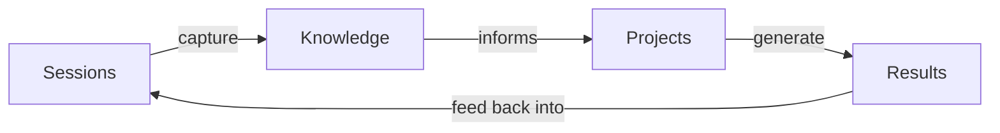
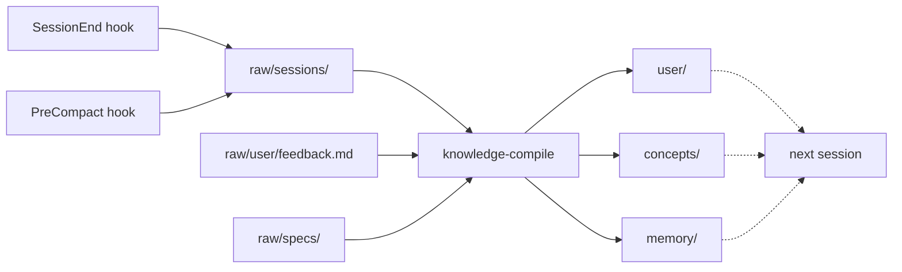
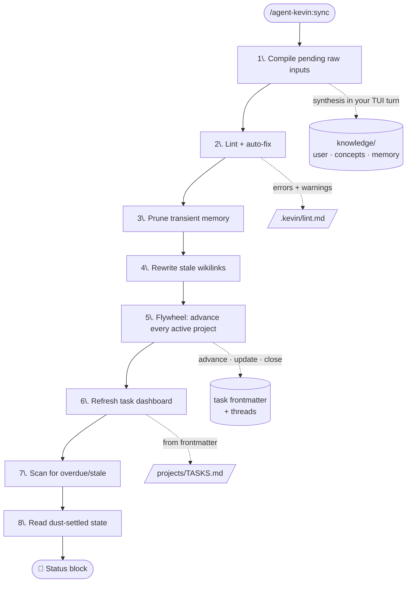
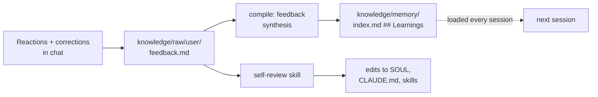
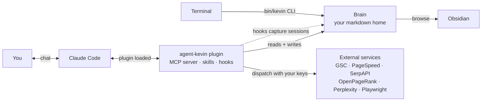

 <div align="center">


# Agent Kevin 🍌

**Your personal AI assistant, as a Claude Code plugin.**
One markdown folder, one plugin, a brain that learns who you are session after session.

<p>
  <a href="./LICENSE"></a>&nbsp;
  <a href="https://docs.claude.com/en/docs/claude-code"></a>&nbsp;
  <a href="#platform-support"></a>&nbsp;
  <a href="https://agentlayer.one"></a>
</p>

</div>

---

## What is Kevin?

Kevin is a portable, file-based personal AI assistant that runs inside [Claude Code](https://docs.claude.com/en/docs/claude-code). Everything that makes Kevin *Kevin*, personality, memory, knowledge, projects, tasks, lives in your own directory as plain markdown. Any AI can read it. You can browse it in Obsidian or Finder. If you ever want to leave Claude Code, you take the folder and go.

This isn't a chat wrapper. It's an **operating system for personal AI**:

- A 24-tool MCP server for tasks, knowledge compilation, search, page-speed, Playwright, and Google Search Console.
- An 18-skill library covering onboarding, project lifecycle, daily/weekly/monthly cadences, and read-only SEO auditing.
- A knowledge pipeline that turns every conversation into structured, queryable memory.
- A skill-pack system for opt-in capabilities (SEO, Browser) and an install-on-demand bridge to community skill libraries via [skills.sh](https://skills.sh).
- All bundled behaviour is `disable-model-invocation: true`. Kevin only acts when you ask, never spontaneously.

> *Kevin is named after the loyal minion. Helpful, enthusiastic, a little nerdy.*

---

## Why you'll want one



**The flywheel.** Every session makes Kevin smarter. Every project generates knowledge. Every piece of knowledge makes the next session better.

- 🧠 **Memory that compounds.** The `SessionEnd` and `PreCompact` hooks copy your conversation to `knowledge/raw/sessions/`. The `knowledge-compile` skill distils those raw logs into structured wiki articles (user profile facets, cross-cutting concepts, active memory). On your next launch, the compiled knowledge loads as @-imports before you've typed a word. **This loop is the entire evolution story.**
- 📋 **Project lifecycles, not just chats.** Spin up projects with `/agent-kevin:create-project`, track tasks with status / priority / dependencies, archive cleanly when they're done. Markdown files. Obsidian-friendly. Git-friendly.
- 🌅 **Daily, weekly, monthly cadences.** Morning briefings, evening wraps, weekly goals, monthly reviews. Built-in skills, run on demand.
- 🔍 **SEO that audits itself.** Plug GSC + PageSpeed + SerpAPI, run `/agent-kevin:google-search-audit`, get a ranked-by-impact diagnostic report.
- 🌐 **Web at your fingertips.** Bundled Playwright + chromium for screenshots, styled PDFs (markdown + mermaid rendered), scripted page recordings. Optional Perplexity for live web research.
- 🏠 **Multiple homes, multiple personas.** One personal Kevin, one work Kevin, one SEO Kevin. Same plugin, different brains.
- ✅ **Subscription-billed**, not API-billed (see [Claude Code Billing](#claude-code-billing)).

---

## Quick start

### Option A: Install via `/plugin` (recommended once published)

First, `cd` to wherever you want Kevin's brain to live and launch Claude Code:

```bash
mkdir -p ~/Documents/Agents/Kevin && cd ~/Documents/Agents/Kevin
claude
```

Inside the session, register the marketplace and install the plugin:

```text
/plugin marketplace add github:AgentLayer1/agentlayer-claude-marketplace
/plugin install agent-kevin@agentlayer
/exit
```

Then enter `claude` again and run `/agent-kevin:init` to scaffold your home (see [Onboarding](#onboarding) below).

### Option B: Local development install

```bash
# Clone the marketplace (contains agent-kevin and any future AgentLayer plugins)
git clone https://github.com/AgentLayer1/agentlayer-claude-marketplace ~/Developer/agentlayer-claude-marketplace

# One-time MCP-server deps install (~150MB, pulls chromium for Playwright)
cd ~/Developer/agentlayer-claude-marketplace/agent-kevin/mcp-server && bun install && cd -

# cd to wherever you want Kevin's brain to live
mkdir -p ~/Documents/Agents/Kevin && cd ~/Documents/Agents/Kevin

# Launch Claude Code pointing at the local plugin dir
claude --plugin-dir ~/Developer/agentlayer-claude-marketplace/agent-kevin
```

Then `/agent-kevin:init` as above.

> Already have a `CLAUDE.md` in the directory? Kevin writes its operating manual to `CLAUDE.local.md` instead and leaves yours alone. Both files load at session start.

---

## Onboarding

```text
> /agent-kevin:init

❓ Kevin's character (SOUL): accept default, or refine?
❓ Kevin's role (IDENTITY): general / coding / research / planning / custom?
❓ Your name and timezone?
❓ Paste any URLs about you (blog, LinkedIn, GitHub, etc.) so Kevin seeds your profile
❓ Paste a path or URL for your avatar (optional, gets linked to knowledge/user/profile.md)
❓ Should knowledge/ and projects/ live somewhere else? (e.g. ~/Documents/Agents/Kevin-Knowledge)
❓ Communication style and any hard preferences?
❓ Configure skill packs (SEO, Browser, third-party libraries)?
❓ Confirm + scaffold
```

Total time: ≈ 5 minutes. Each question's answer becomes the default for later steps. The wizard writes:

- `CLAUDE.md` (operating manual + identity @-imports), or `CLAUDE.local.md` if a CLAUDE.md already exists
- `SOUL.md`, `IDENTITY.md`, `USER.md` (Kevin's character / role / your headline)
- `knowledge/` and `projects/` directory trees, optionally at custom locations
- `.claude/settings.json` (marketplace registration + pre-granted permissions for plugin tools)
- `.claude/settings.local.json` (API keys, gitignored) and `.mcp.json` (Perplexity, etc.) if you opt in to packs

If you chose custom `KEVIN_KNOWLEDGE` or `KEVIN_PROJECTS` paths **outside the home directory**, the wizard appends the required `permissions.allow` entries and (where supported) `sandbox.filesystem.allowWrite` entries to `<HOME>/.claude/settings.json` so Claude Code can read/write there without prompting you on every operation.

### Exit and relaunch

The plugin registration in `.claude/settings.json` only takes effect on a fresh session. After init:

```bash
/exit
cd ~/Documents/Agents/Kevin && claude
```

**Watch for a marketplace trust prompt** on first relaunch. Accept it. If you miss it, recover with `/plugin marketplace add ...` + `/plugin install agent-kevin@agentlayer`.

---

## What a session looks like

```text
$ cd ~/Documents/Agents/Kevin && claude

  🧠 Knowledge: ~/Documents/Agents/Kevin/knowledge
  📁 Projects:  ~/Documents/Agents/Kevin/projects
  📚 Context  · 4.2KB
    ✓ session tail   1.6KB  (YYYY-MM-DD.md)
    ✓ git activity   0.3KB  (15 commits in the last week)

> /context
Context loaded from <HOME>/CLAUDE.md and its @-imports:

  CLAUDE.md                                operating manual + @-imports
  └─ @SOUL.md                              Kevin's character
  └─ @IDENTITY.md                          Kevin's role
  └─ @USER.md                              who you are
  └─ @knowledge/index.md                   master catalog
  └─ @knowledge/memory/index.md            active threads · decisions · learnings
  └─ @knowledge/user/profile.md            bio, life context
  └─ @knowledge/user/skills.md             technical abilities, tools
  └─ @knowledge/user/preferences.md        workflow, communication patterns
  └─ @knowledge/user/career.md             professional history
  └─ @knowledge/user/interests.md          vision, hobbies, signal topics
  └─ @projects/TASKS.md                    cross-project task dashboard

Dynamic (per-session, injected by SessionStart hook):
  · today's date (YYYY-MM-DD, <your-timezone>)
  · last session tail (yesterday's conversation)
  · recent git activity in knowledge/

Plugin: agent-kevin@agentlayer · 24 MCP tools loaded

> /agent-kevin:morning-briefing
[Kevin reads your active threads, in-flight tasks, anything overdue, and surfaces what
 deserves your attention today, using yesterday's session tail as continuity context]

> Create a project called "new-blog". I want to relaunch under a different domain.
[Kevin runs /agent-kevin:create-project, scaffolds projects/new-blog/, registers the
 prefix, asks you for the one-line vision, opens for your first task]

> Audit the site I have in Search Console.
[Kevin runs /agent-kevin:google-search-audit, pulls 28 days of GSC, PSI on the top 5
 pages, applies 4 rules, ranks findings by impact, writes the report to
 projects/<slug>/audits/YYYY-MM-DD.md, threads matching findings into open tasks]

> /exit
[SessionEnd hook captures the conversation to knowledge/raw/sessions/YYYY-MM-DD.md,
 redacting any API key values from settings.local.json before persisting.
 Next time you run /agent-kevin:knowledge-compile, this session feeds into Kevin's
 long-term memory.]
```

The header banner (`🧠 Knowledge / 📁 Projects / 📚 Context`) is what the SessionStart hook injects on every launch — quick proof your brain is wired up. The `/context` slash command (built into Claude Code) shows the full @-imports cascade: every identity file, every knowledge index, the dynamic per-session additions. That whole tree is in Kevin's working memory before you've typed your first real prompt.

---

## How the knowledge pipeline works (the central evolution loop)

Kevin's long-term memory follows Andrej Karpathy's [LLM Wiki](https://gist.github.com/karpathy/442a6bf555914893e9891c11519de94f) pattern. Raw conversations are source code, an LLM is the compiler, the compiled wiki is your queryable second brain.



**The capture is automatic.** Every time you exit a session, or Claude Code auto-compacts mid-session, a hook script reads your transcript and appends it to today's session log under `knowledge/raw/sessions/YYYY-MM-DD.md`. The hook **redacts API key values** before writing (exact-match against `.claude/settings.local.json` env values, plus prefix heuristics for `sk-…`, `pplx-…`, `AIza…`, `sk-ant-…`, `gh[pous]_…`).

**The compile is on-demand.** When you run `/agent-kevin:knowledge-compile`, Kevin picks up any session logs whose hash has changed since last compile, plus any specs you've dropped into `knowledge/raw/specs/`, plus any new feedback in `knowledge/raw/user/feedback.md`. The MCP server returns a synthesis prompt; *you*, in your TUI session, synthesize; the MCP server confirms the write. Idempotent, hash-tracked, interruptible.

| Output | Lifecycle | What lives there |
|---|---|---|
| `knowledge/user/` | Permanent, evolves with you | profile, skills, preferences, career, interests, the durable facets refined every compile |
| `knowledge/concepts/` | Permanent, cross-cutting | patterns and strategies spanning multiple projects. Specs distill into concepts here |
| `knowledge/memory/` | Hot context (`index.md` loads every session) | active threads, recent decisions, learnings from feedback. Daily entries auto-prune after 14 days |

**Why this stays cheap.** The compile MCP tool returns a synthesis prompt, Claude Code (you, in your TUI turn) runs the synthesis using your subscription, the result is written back via another MCP call. No internal LLM-as-a-service, no API billing.

---

## Sync: end-to-end maintenance in one pass

`/agent-kevin:sync` runs the whole maintenance chain — compile → lint → prune → links → **flywheel** → dashboard → scan → status — when you want every derived view brought current at once. Heavier than `quick-pulse`, lighter than running each skill manually.



The dependency order is the point: compile feeds the wiki state that lint operates on; lint's auto-fix touches the same articles the dashboard's task-link rewriter needs to be clean. Flywheel runs *after* the wiki is clean (so it reads a current memory index) and *before* the dashboard refresh (so the dashboard reflects post-flywheel task state). Scan reads the just-rebuilt dashboard. Running steps out of order makes you re-reconcile.

The status block reads from the **dust-settled artifacts** (`projects/TASKS.md`, `.kevin/lint.md`, `knowledge/memory/index.md`) — not from per-tool return values — so the summary reflects what's actually on disk after every mutation has landed. See [`skills/sync/SKILL.md`](skills/sync/SKILL.md) for the protocol.

---

## Self-evolution: Kevin gets better the more you use him



Every time you correct Kevin mid-conversation ("don't do that", "actually, that's wrong"), the SessionEnd hook captures the correction into `knowledge/raw/user/feedback.md`, append-only, durable. The next `knowledge-compile` run synthesises all feedback into a `## Learnings` block in `knowledge/memory/index.md`, which loads as static memory at the start of every future session. Kevin sees his own past misses while he works and self-corrects in real time.

When you have ten minutes, run `/agent-kevin:self-review`. Kevin reads the accumulated feedback + `## Learnings`, proposes 1-3 targeted edits to his SOUL or to specific SKILL.md files, and lets you pick what to change. Code-change proposals get written to `<HOME>/.claude/plans/` for you to implement separately, never auto-applied.

**Three stages, loosely coupled.** Capture is automatic. Compile is on-demand. Review is manual. No ceremony.

---

## Use cases

### 1. Personal home base
Track your projects, plan your weeks, capture decisions, remember context across sessions. Spin up `cd ~/Documents/Agents/Kevin && claude` whenever you want, ask Kevin what you were working on last Tuesday, get a coherent answer because the session tail loaded itself.

### 2. SEO + content workflow for one site
Configure GSC + PageSpeed + SerpAPI keys once. Run `/agent-kevin:google-search-audit` weekly (or wire it to cron). Get a markdown report ranked by impact, findings threaded into existing tasks. Pair with optional [third-party SEO libraries](#third-party-skill-libraries) for content drafting + EEAT scoring.

### 3. Multiple flavours of Kevin
Different homes for different roles. Each home is its own brain with its own configured skill packs.

```bash
~/Documents/Agents/personal-kevin/    # personal projects, journals, life ops
~/Work/agents/work-kevin/             # client projects, professional persona
~/Documents/Agents/seo-kevin/         # SEO-focused, only the SEO pack configured
```

The plugin code lives once on disk. Each home is independent. Switch by `cd`-ing into the home you want and launching `claude`. The right brain loads automatically.

### 4. Augmenting an existing project
You already have a project with its own `CLAUDE.md`. You want Kevin's memory + task system layered on top, without overwriting your existing instructions.

```bash
cd ~/Developer/my-existing-project
claude
/agent-kevin:init
```

Init detects the pre-existing `CLAUDE.md` and writes Kevin's operating manual to `CLAUDE.local.md` instead. Both files load at session start (Claude Code natively merges them). Your project context and Kevin's identity coexist.

### 5. Team-shared agent in a shared repo
Drop Kevin into a team repo, commit the `<HOME>/{CLAUDE.md, SOUL.md, IDENTITY.md, .claude/settings.json, knowledge/}` files, gitignore `settings.local.json`. Every teammate gets the same agent identity. Each accepts the trust prompt once on first launch.

---

## Architecture

The brain is portable markdown on your disk. Claude Code is the runtime. The plugin is the glue. Obsidian is how a human reads the brain. Terminal-driven scripts read and write the brain directly via `bin/kevin` when you don't want a session.



| Layer | What | Where |
|---|---|---|
| **You** | The decision maker | wherever you are |
| **Claude Code** | The AI runtime that reads the brain and acts on it | your terminal |
| **Plugin** | Skill bodies, MCP server, hooks | `agent-kevin/` (one repo, multiple homes) |
| **Brain** | Personality, knowledge, projects, everything that makes Kevin *yours* | `<HOME>/` (portable markdown) |
| **Obsidian** | Human-facing browser for the brain — clickable wiki-links, daily notes, graph view | `<HOME>/` opened as an Obsidian vault |
| **Terminal** | Bypass route for scripted task ops and headless compile runs | shell `bin/kevin` invocations |
| **External services** | Optional tools the MCP server dispatches to with your API keys | GSC, PageSpeed, SerpAPI, OpenPageRank, Perplexity, in-process Chromium |

---

## What you get

### Core skills (13), always loaded

| Skill | What it does |
|---|---|
| `init` | First-run onboarding |
| `configure-skills` | Configure skill packs, install third-party libraries |
| `knowledge-compile` | Synthesise raw sessions/feedback/specs into the wiki |
| `create-project` / `archive-project` | Project lifecycle |
| `flywheel` | Cross-project work session |
| `sync` | End-to-end maintenance: compile → lint+fix → memory-prune → dashboard refresh → briefing in one pass |
| `morning-briefing` / `evening-briefing` | Daily orient + wrap |
| `weekly-goals` / `monthly-goals` | Goal-setting cadences |
| `quick-pulse` | 60-second status check |
| `self-review` | Process feedback into skill refinements |

> Custom-skill authoring isn't a Kevin skill, because Claude Code already ships a native [`skill-creator`](https://github.com/anthropics/claude-plugins-official) plugin that does exactly that. Use it for your own skills.

### SEO pack (6), pre-loaded, configured via `/agent-kevin:configure-skills`

`serpapi` · `open-page-rank` · `google-search-console` · `google-page-speed` · `wordpress-rest` · `google-search-audit`

Four need API keys (SerpAPI, OpenPageRank, Google OAuth + `GSC_SITE_URL` for the last two). `wordpress-rest` uses `curl` with a host-scoped permission grant derived from `GSC_SITE_URL`. `google-search-audit` is a composite read-only audit using everything above.

### Browser pack, configured on demand

- **Perplexity**, live web search with citations (`mcp__plugin_agent-kevin_kevin__perplexity_search`). Built into the `kevin` MCP server — direct call to the Perplexity Search API, no extra subprocess; just set `PERPLEXITY_API_KEY` via `/agent-kevin:configure-skills` to activate. Way better answers than vanilla web-search and dirt-cheap on pay-as-you-go: $5 of credit lasts most personal users several days to several weeks depending on query volume. Get a key at [perplexity.ai/settings/api](https://perplexity.ai/settings/api).
- **Playwright**, screenshot any URL, render any markdown to a styled PDF (with mermaid diagrams), record scripted page interactions. Chromium ships in the one-time `bun install`.

### Third-party skill libraries

Installed on demand via [skills.sh](https://skills.sh). Pure-prompt content/marketing skill libraries are not bundled. They install via Vercel Labs' `skills` CLI into `<HOME>/.claude/skills/` as symlinks into the skills.sh cache, so upstream updates propagate without re-running install. Currently offered:

- **[`aaron-he-zhu/seo-geo-claude-skills`](https://github.com/aaron-he-zhu/seo-geo-claude-skills)** (Apache-2.0): 20-skill SEO + GEO library including `content-quality-auditor` (80-item CORE-EEAT audit), `seo-content-writer`, `content-refresher`, `domain-authority-auditor`.
- **[`coreyhaines31/marketingskills`](https://github.com/coreyhaines31/marketingskills)**: 23 marketing playbooks (CRO, SEO, copy, analytics, experiments, pricing, launches, ads, social).

Install: `/agent-kevin:configure-skills` → tick "Third-party libraries".

### MCP tools (24)

| Group | Tools |
|---|---|
| **Tasks** (7) | `task_query`, `task_get`, `task_create`, `task_update`, `task_close`, `task_thread`, `task_scan` |
| **Knowledge** (5) | `memory_prune`, `links_rewrite`, `compile_status`, `compile_next`, `compile_write` |
| **Dispatch** (12) | `serpapi_search`, `open_page_rank`, `google_auth`, `gsc_query`, `gsc_inspect`, `gsc_sites`, `page_speed_psi`, `page_speed_audit`, `playwright_screenshot`, `playwright_pdf`, `playwright_record`, `ping` |

All pre-granted via `permissions.allow` at init, so tool calls never trigger per-call confirm prompts.

### Hooks

- **SessionStart**: pre-init shows the setup banner. Post-init injects today's date, last session tail, recent git activity (≤10KB).
- **SessionEnd + PreCompact**: capture transcript turns to `knowledge/raw/sessions/YYYY-MM-DD.md` with API key redaction. **This is what makes the flywheel work.** Without these hooks, Kevin would have no source material to compile into long-term memory.

---

## How it's laid out

### The plugin (this repo)

```
agent-kevin/
├── .claude-plugin/
│   └── plugin.json          # plugin manifest
├── assets/                  # Kevin's avatar, AgentLayer logo
├── bin/
│   └── kevin                # standalone CLI for shell-driven task ops
├── hooks/
│   └── hooks.json           # SessionStart + SessionEnd + PreCompact
├── mcp-server/              # the kevin MCP server (Bun)
│   ├── src/
│   └── package.json
├── scripts/                 # hook scripts (Bun)
├── skills/                  # 18 skills (12 core + 6 SEO) auto-load with plugin
├── templates/               # init copies these into <HOME>
│   ├── CLAUDE.md            # → <HOME>/CLAUDE.md (or CLAUDE.local.md on collision)
│   ├── IDENTITY.md          # Kevin's role (includes Kevin's avatar)
│   ├── SOUL.md              # Kevin's character
│   └── USER.md              # YOUR headline + links to knowledge/user/
├── .mcp.json                # declares the `kevin` MCP server
├── LICENSE                  # Apache 2.0
└── NOTICE                   # Apache 2.0 attribution
```

### Your agent home (after `init`)

```
<HOME>/
├── .claude/
│   ├── assets/              # Kevin's avatar (kept out of the home root)
│   ├── skills/              # third-party skill libraries installed via skills.sh (lazy)
│   ├── settings.json        # enabledPlugins + pre-granted permissions
│   └── settings.local.json  # API keys, gitignored
├── .kevin/                  # plugin runtime state (hidden)
│   ├── config/              # OAuth tokens
│   ├── logs/
│   └── knowledge.json       # compile state
├── knowledge/               # (or KEVIN_KNOWLEDGE elsewhere)
│   ├── concepts/            # cross-cutting articles
│   ├── memory/              # hot context (threads, decisions, learnings)
│   ├── raw/                 # unprocessed inputs to compile
│   │   ├── archive/         # compiled specs land here after compile
│   │   ├── sessions/        # auto-captured conversations (the source of evolution)
│   │   ├── specs/           # drop design docs here for distillation
│   │   └── user/
│   │       └── feedback.md  # corrections log (append-only)
│   ├── user/                # evolving long-form knowledge about you (incl. profile.md with your avatar)
│   └── index.md             # master catalog
├── projects/                # (or KEVIN_PROJECTS elsewhere)
│   ├── <slug>/
│   │   ├── tasks/
│   │   │   └── <id>-<slug>.md
│   │   └── README.md
│   └── TASKS.md
├── .mcp.json                # only present if the user adds their own MCP servers — Kevin's bundled `kevin` server lives in the plugin's own .mcp.json
├── CLAUDE.md                # operating manual + @-imports for identity stack
│                            # (or CLAUDE.local.md if CLAUDE.md pre-existed)
├── IDENTITY.md              # Kevin's role + evolving self-description
├── SOUL.md                  # Kevin's character
└── USER.md                  # YOUR headline + links to knowledge/user/
```

Open `<HOME>/` in Obsidian to browse with working wiki-links. `.claude/` and `.kevin/` are hidden by default.

---

## Outside Claude Code: `bin/kevin` CLI

For terminal-driven task ops, cron jobs, scripted compile prep:

```bash
export PATH="$HOME/Developer/agentlayer-claude-marketplace/agent-kevin/bin:$PATH"

kevin help     # full command reference
```

`kevin help` prints groups, commands, flags, env vars, and examples. The major groups:

| Group | What it does |
|-------|--------------|
| `kevin task <subcmd>` | Query, get, create, update, close, thread, scan, dashboard tasks |
| `kevin knowledge lint [--fix]` | Structural wiki health check (broken links, orphans, missing backlinks, sparse, invalid frontmatter); `--fix` auto-rewrites links + inserts backlinks |
| `kevin compile <subcmd>` | `status` (queue), `next` (peek), `write <id>` (mark complete). Synthesis itself runs in Claude Code via `/agent-kevin:knowledge-compile` |
| `kevin prune` | Delete `memory/YYYY-MM-DD*.md` older than the retention window (14 days) |
| `kevin links` | Rewrite bare task IDs + shorthand into `[[wikilinks]]` across the wiki |
| `kevin ping` | Print resolved paths + timezone (sanity check) |

Common examples:

```bash
kevin task query --status=active
kevin task create --project=blog-dev --title="Draft launch post" --description="..." --priority=P1
kevin task dashboard                  # rebuild projects/TASKS.md from frontmatter
kevin knowledge lint --fix            # check wiki + auto-fix broken links + backlinks
kevin compile status                  # what's pending compile
```

Note: `bin/kevin` invokes the MCP server logic locally without going through Claude Code. The compile pipeline returns prompts (not synthesized output), so full evolution still needs a TUI session — see [`/agent-kevin:knowledge-compile`](skills/knowledge-compile/SKILL.md) for the orchestration loop, or [`/agent-kevin:sync`](skills/sync/SKILL.md) to run compile → lint → dashboard → briefing in one pass.

---

## Configuration

| Env var | Purpose | Default |
|---|---|---|
| `KEVIN_HOME` | Override Kevin's data dir | current working directory at launch |
| `KEVIN_TIMEZONE` | IANA timezone for date formatting | system timezone |
| `KEVIN_KNOWLEDGE` | Override knowledge dir | `$KEVIN_HOME/knowledge` |
| `KEVIN_PROJECTS` | Override projects dir | `$KEVIN_HOME/projects` |

`KEVIN_KNOWLEDGE` and `KEVIN_PROJECTS` let you put those directories anywhere (e.g. iCloud, an external drive, a separate git repo). The init wizard offers this during scaffold and, if the chosen path is **outside the agent home**, automatically appends `permissions.allow` (and `sandbox.filesystem.allowWrite` where supported) entries to `<HOME>/.claude/settings.json` so Claude Code can read/write there without prompting. If you set these env vars after init, edit `settings.json` yourself.

API keys (`SERPAPI_KEY`, `OPENPAGERANK_API_KEY`, `GSC_SITE_URL`, `PERPLEXITY_API_KEY`, etc.) live in `<HOME>/.claude/settings.local.json` `env` block, gitignored, written by `configure-skills`.

---

## Optional: capture every Claude session, machine-wide

By default Kevin only captures sessions when you launch `claude` from inside your agent home (the plugin's hooks fire on enabled-plugin sessions). If you want **every** Claude Code session on your machine — coding work in random repos, one-off Q&A, anything — to land in your knowledge base, add user-level hooks to `~/.claude/settings.json`:

```json
{
  "env": {
    "KEVIN_HOME": "/absolute/path/to/your/agent/home"
  },
  "hooks": {
    "SessionEnd": [
      {
        "matcher": "",
        "hooks": [
          {
            "type": "command",
            "command": "bun /absolute/path/to/agent-kevin/scripts/session-capture.ts session-end",
            "timeout": 30
          }
        ]
      }
    ],
    "PreCompact": [
      {
        "matcher": "",
        "hooks": [
          {
            "type": "command",
            "command": "bun /absolute/path/to/agent-kevin/scripts/session-capture.ts pre-compact",
            "timeout": 30
          }
        ]
      }
    ]
  }
}
```

**Why this is useful.** Kevin's knowledge compounds from raw session inputs. The richer the input stream, the richer the wiki. A coding session in another repo that mentions a new library, a debugging conversation that surfaces a workflow rule, a one-off chat that captures a decision — all of those would normally be lost. With capture-everywhere wired in, they all land in `<HOME>/knowledge/raw/sessions/YYYY-MM-DD.md` and feed the next `/agent-kevin:knowledge-compile` run.

**How it stays safe.** The capture script's `isInitialized()` guard checks for `<KEVIN_HOME>/SOUL.md` before writing — if your `KEVIN_HOME` env var is misconfigured or points at a non-Kevin directory, the script logs a skip and exits. It won't pollute random dirs.

**Three things to choose:**

1. **Both hooks, recommended** — `SessionEnd` captures complete conversations; `PreCompact` captures long sessions before Claude's auto-compaction discards detail. Together they cover ~all conversational content.
2. **`SessionEnd` only** — lighter. You'll lose detail from sessions that hit auto-compact before you exit cleanly.
3. **Don't set this up** — only sessions launched from your agent home get captured. Simplest, but you'll miss cross-repo signal.

**Trade-offs:**

- The hardcoded plugin path means moving/uninstalling the plugin breaks the hooks. Acceptable for personal use; not portable across machines.
- Every Claude session pays a small startup cost to run the hook (≈100ms). Negligible.
- This does **not** enable the plugin globally — no MCP tools or identity stack loads in non-Kevin sessions. The hooks are isolated.
- If you also want Kevin's full context (skills, MCP tools) available everywhere, enable the plugin globally instead in your `~/.claude/settings.json` `enabledPlugins` block. This is heavier and usually not what you want.

After editing `~/.claude/settings.json`, launch `claude` from any directory, have a one-turn conversation, `/exit`, then check `<KEVIN_HOME>/knowledge/raw/sessions/<today>.md` — a new block should be appended.

---

## Privacy

- **All data stays local.** Your agent home is markdown on your disk. No cloud sync unless you choose to commit it to git.
- **API keys live in `.claude/settings.local.json` and data in `.kevin/`**, gitignored by default. The plugin's `.gitignore` includes them.
- **Transcripts are redacted before persisting.** The session-capture hook scrubs all values present in `settings.local.json` and runs prefix heuristics for common key formats.
- **Anthropic training opt-out + telemetry disable** is recommended on your Claude Code install. See [docs.claude.com](https://docs.claude.com).
- **The folder is the product.** If anything goes wrong, the markdown + git history is the complete backup.

---

## Platform support

Built and tested on **macOS**. The plugin should work on **Linux** with one caveat: chromium auto-install via `playwright` is sometimes flaky in headless sandboxes. **Windows is untested**; the Bun-based hooks and MCP server should run under WSL2 but the per-skill `bash` patterns in `permissions.allow` (e.g. `Bash(git log *)`) assume a POSIX shell. PowerShell equivalents would need to be added separately.

If you run Kevin successfully on Linux or Windows, please open a PR with platform-specific install notes.

---

## Claude Code Billing

`/agent-kevin:knowledge-compile` is the showcase of how this plugin handles billing. Other personal-AI setups call the LLM internally, which bills against a metered API key. This plugin doesn't. The MCP server returns a synthesis prompt; *you*, in your interactive Claude Code session, do the synthesis; the MCP server confirms the write. The thinking happens inside your TUI turn, so it draws from your Claude Code subscription pool (Max / Pro / Teams), not a per-token API bucket.

Verify it yourself:

1. Open Anthropic Console → Usage. Note current API cost.
2. Run `/agent-kevin:knowledge-compile` inside Claude Code.
3. Refresh Usage. API cost should not change. Subscription usage should increment.

If it does change, open an issue — that assumption was wrong.

### A note on what Kevin used to be

Kevin started life as a much more ambitious thing: a [standalone Bun daemon](https://github.com/AgentLayer1/agent-kevin) running a Telegram bot for the whole family, a cron-style heartbeat scheduler that woke Kevin up at 7am to send morning briefings, evening wraps that arrived while you were cooking dinner, the homeschool planner that produced actual printable HTMLs for the kids before the school week, autonomous knowledge compiles every six hours. The brain was the same markdown folder you see here. The body was a long-running process talking to the Claude Agent SDK on your behalf, calling out from your phone, the office, the car.

Then Anthropic [closed off](https://www.anthropic.com/news/claude-developer-platform) the Claude Agent SDK from subscription billing. Headless SDK calls became pay-per-token-API only. The whole point of Kevin was that he ran on your Max/Pro subscription bucket, not a metered API; the cost ceiling was a flat monthly bill, not "what did Kevin do while you were sleeping." Without subscription-backed SDK, the daemon model couldn't survive.

So Kevin had to die a little bit inside, and Kevin had to be reborn as a Claude Code plugin. The brain is intact. The skills got ported. The MCP server runs locally, returning prompts that *you*, in your TUI session, synthesize using your subscription. That's why everything in this plugin is structured to make Claude Code do the LLM work, not the plugin itself. No API charges, ever.

What that means in practice:

- ✅ **You drive every session.** Kevin is reactive, not proactive. You type `claude`, Kevin loads, you ask.
- ❌ **No proactive messaging.** No "morning briefing at 7am" delivered to your phone. You run `/agent-kevin:morning-briefing` when you sit down.
- ❌ **No Telegram bridge.** No texting Kevin from the airport.
- ❌ **No cron daemon.** External schedulers (launchd, cron, GitHub Actions) can invoke Kevin via `claude --print`, but they pay-per-token-API. Inside-CC manual runs stay subscription-billed.
- ✅ **Everything else.** Memory compounding, the wiki pipeline, projects, tasks, audits, briefings on demand. All here.

If Anthropic ever reopens the Agent SDK to subscription billing, we'll happily revive the daemon. Until then, this plugin is the maximum amount of Kevin that fits inside the rules.

## Common questions

**Q: Do I need to be a developer to use this?**
A: You need to clone a git repo, run `bun install`, and launch Claude Code. After that, the entire experience is conversational. `/agent-kevin:init` walks you through everything.

**Q: I finished `/init` and relaunched, but no SessionStart banner appears.**
A: The marketplace trust prompt was missed. Recover inside Claude Code with `/plugin marketplace add github:AgentLayer1/agentlayer-claude-marketplace` followed by `/plugin install agent-kevin@agentlayer`, then `/exit` and relaunch.

**Q: I already had a CLAUDE.md in this directory before installing Kevin. Did it get overwritten?**
A: No. Init detects pre-existing `CLAUDE.md` and writes Kevin's operating manual to `CLAUDE.local.md` instead. Both files load at session start.

**Q: How do I update the plugin?**
A: `/plugin marketplace update agentlayer` from inside Claude Code. Or if you cloned locally, `git pull` the marketplace repo. Your `<HOME>/` data is untouched.

**Q: How do I uninstall?**
A: `/plugin uninstall agent-kevin@agentlayer`. Your `<HOME>/` data stays. To purge everything: `rm -rf <HOME>/`.

**Q: Will Kevin ever message me first?**
A: No. See [Claude Code Billing](#claude-code-billing). Inside Claude Code, you initiate every session. External schedulers can pipe prompts into `claude --print` but those go through pay-per-token API.

**Q: Subscription billing, does it really avoid API costs?**
A: For the LLM synthesis steps yes. The MCP server is pure I/O, returning prompts; your interactive Claude Code session does the thinking using your subscription quota. To verify: note Anthropic Console → Usage before running `/agent-kevin:knowledge-compile`, refresh after. API cost should not change; subscription usage should increment.

---


---

## Known limitations

1. **CC must open in `<HOME>`** for static identity to load. Outside, you only get the dynamic lane.
2. **Sandbox can block `.claude/skills/` writes** during `/agent-kevin:configure-skills`. Pre-create the dir from a normal terminal if it hits the wall.
3. **Playwright + macOS sandbox.** Browser launch can fail inside CC's sandboxed subprocesses (XPC walls). Workaround: install playwright manually in a normal terminal so chromium caches.
4. **No GUI / dashboard.** Tasks render in your terminal or in Obsidian.
5. **Single-user.** Multi-user / team-isolation isn't built in. Workaround: separate homes per user.
6. **No proactive Kevin.** See [Claude Code Billing](#claude-code-billing). External schedulers can run Kevin via `claude --print`, but those calls bill against API quota, not your subscription.

---

## Contributing

Pull requests welcome. Particularly interested in:

- New skill packs that ship as opt-in via `configure-skills`
- New MCP dispatch tools that fit the read-mostly + key-gated model
- Linux / Windows platform notes
- Documentation improvements, more use-case examples
- Translations / regional compliance hints

Open an issue first for architectural changes. Kevin's contract with `<HOME>/` markdown is intentional and worth preserving.

---

## License

Licensed under the [Apache License, Version 2.0](./LICENSE).

`agent-kevin` is © AgentLayer · [agentlayer.one](https://agentlayer.one). See [NOTICE](./NOTICE) for the attribution stanza.

Third-party skill libraries installable via `/agent-kevin:configure-skills` are not bundled with this plugin. They install via [skills.sh](https://skills.sh) into `<HOME>/.claude/skills/`, each carrying its own LICENSE. Review each library's terms before relying commercially.

---

<div align="center">

<a href="https://agentlayer.one"></a>

**Built by [AgentLayer](https://agentlayer.one)** · *agentic infrastructure for AI-native operations*

*Kevin is named after the loyal minion. Helpful, enthusiastic, a little nerdy.*

</div>
